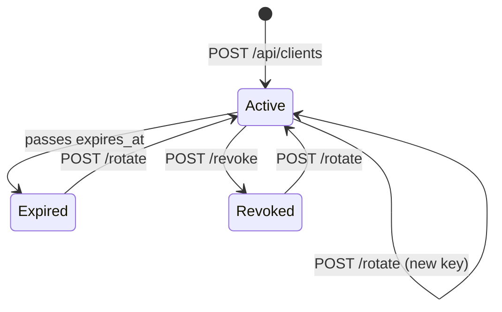

# Clients and API keys

Prefix: `/api/clients` · **Scope:** `admin` on every route

Each system consuming this service is a *client* with its own API key and its own scopes.

---

## Anatomy of an API key

```
lbs_a1b2c3d4e5f6_XoP9wQ7rT2vK8mN4jH1sD6gF3aZ5cV0bY9uE7iO2pL
└┬┘ └─────┬─────┘ └──────────────────┬──────────────────────┘
 │        │                          │
 │        │                          └─ secret, 32 url-safe bytes
 │        └─ prefix, 6 hex bytes (12 characters)
 └─ fixed label
```

| Part | How it is stored |
| --- | --- |
| Prefix | In the clear, in `api_clients.key_prefix`. Identifies the client and serves as index |
| Secret | Only its **HMAC-SHA256** with `API_KEY_PEPPER` |

Verification uses `hmac.compare_digest`, in constant time.

!!! danger "The secret cannot be recovered"
    It is shown exactly once, when the key is created or rotated. If lost, the only way out
    is rotation.

---

## Create a client

```http
POST /api/clients
```

**Format:** `application/json` · **Response:** `201`

```json
{
  "name": "erp-production",
  "scopes": ["auth", "enroll"],
  "expires_in_days": 365
}
```

| Field | Required | Description |
| --- | --- | --- |
| `name` | yes | 3 to 120 characters, unique |
| `scopes` | no | List of `auth`, `enroll`, `admin`. Defaults to `["auth"]` |
| `expires_in_days` | no | 1 to 3650. Defaults to `API_KEY_DEFAULT_DAYS` |

```json
{
  "uuid": "3f9c1d8e-...",
  "name": "erp-production",
  "scopes": ["auth", "enroll"],
  "expires_at": "2027-08-16T10:22:41",
  "api_key": "lbs_a1b2c3d4e5f6_XoP9wQ...",
  "aviso": "Guarda esta API key ahora: no se puede volver a consultar."
}
```

| Code | When |
| --- | --- |
| 400 | An unknown scope, or an empty list |
| 409 | A client with that name already exists |

!!! tip "One key per system and per environment"
    `erp-production`, `erp-staging`, `hr-portal`. That way revoking one does not take down
    the others, and `last_used_at` genuinely tells you who is using what.

---

## List clients

```http
GET /api/clients
```

```json
[
  {
    "uuid": "3f9c1d8e-...",
    "name": "erp-production",
    "key_prefix": "a1b2c3d4e5f6",
    "scopes": ["auth", "enroll"],
    "active": true,
    "expired": false,
    "usable": true,
    "created_at": "2026-08-16T10:22:41",
    "expires_at": "2027-08-16T10:22:41",
    "last_used_at": "2026-08-16T14:03:12",
    "created_by": "portal:admin"
  }
]
```

| Field | Meaning |
| --- | --- |
| `active` | Not revoked |
| `expired` | Past its `expires_at` |
| `usable` | `active` and not `expired`: the only thing that decides whether the key works |
| `last_used_at` | Last request accepted with that key |
| `created_by` | Who created it (`portal:user` or `apikey:prefix`) |

The secret never appears in this response.

---

## Revoke

```http
POST /api/clients/{client_uuid}/revoke
```

```json
{"revoked": "3f9c1d8e-...", "name": "erp-production"}
```

Sets `active = false` and invalidates the in-memory cache immediately. The next request
with that key gets **401**.

**404** if the UUID does not exist.

---

## Rotate

```http
POST /api/clients/{client_uuid}/rotate
```

| Query parameter | Description |
| --- | --- |
| `expires_in_days` | New expiry. If omitted, keeps the existing one |

```bash
curl -X POST "http://localhost:8000/api/clients/3f9c1d8e-.../rotate?expires_in_days=180" \
  -H "Authorization: Bearer $PORTAL_TOKEN"
```

```json
{
  "uuid": "3f9c1d8e-...",
  "name": "erp-production",
  "api_key": "lbs_9z8y7x6w5v4u_KpL3...",
  "expires_at": "2027-02-12T10:22:41",
  "aviso": "La API key anterior queda invalidada de inmediato."
}
```

Generates a new prefix and secret, reactivates the client if it was revoked, and
invalidates both the old and the new prefix in cache.

!!! warning "Rotation has no grace period"
    The previous key stops working instantly. Deploy the new one **before** rotating, or
    create a new client, migrate, and revoke the old one afterwards.

---

## Lifecycle



Only a `usable` client (active and not expired) authenticates requests.

---

## Validation cache

Resolved keys are cached for **60 seconds** in process memory to avoid hitting the database
on every request. `revoke` and `rotate` invalidate the entry immediately in the process
handling the call.

The `last_used_at` field is updated at most once every **300 seconds** per client, to avoid
writing to the database on every request. It is an approximate activity marker, not an
audit record.

!!! warning "With several workers, the cache is not shared"
    Each uvicorn process has its own. Revoking from one worker does not clear the others'
    caches, so **a revoked key can keep working for up to 60 seconds** in the other
    workers. Production with multiple processes needs this moved to Redis. See
    [Known limitations](../operacion/limitaciones.md).
