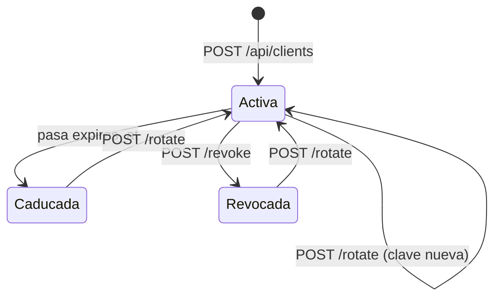

# Clientes y API keys

Prefijo: `/api/clients` · **Permiso:** `admin` en todas las rutas

Cada sistema que consume este servicio es un *cliente* con su propia API key y sus propios
permisos.

---

## Anatomia de una API key

```
lbs_a1b2c3d4e5f6_XoP9wQ7rT2vK8mN4jH1sD6gF3aZ5cV0bY9uE7iO2pL
└┬┘ └─────┬─────┘ └──────────────────┬──────────────────────┘
 │        │                          │
 │        │                          └─ secreto, 32 bytes url-safe
 │        └─ prefijo, 6 bytes hex (12 caracteres)
 └─ etiqueta fija
```

| Parte | Como se guarda |
| --- | --- |
| Prefijo | En claro, en `api_clients.key_prefix`. Identifica al cliente y sirve de indice |
| Secreto | Solo su **HMAC-SHA256** con `API_KEY_PEPPER` |

La verificacion usa `hmac.compare_digest`, en tiempo constante.

!!! danger "El secreto no se puede recuperar"
    Se muestra una unica vez, al crear o rotar la clave. Si se pierde, la unica salida es
    rotarla.

---

## Crear un cliente

```http
POST /api/clients
```

**Formato:** `application/json` · **Respuesta:** `201`

```json
{
  "name": "erp-produccion",
  "scopes": ["auth", "enroll"],
  "expires_in_days": 365
}
```

| Campo | Obligatorio | Descripcion |
| --- | --- | --- |
| `name` | si | 3 a 120 caracteres, unico |
| `scopes` | no | Lista de `auth`, `enroll`, `admin`. Por defecto `["auth"]` |
| `expires_in_days` | no | De 1 a 3650. Por defecto `API_KEY_DEFAULT_DAYS` |

```json
{
  "uuid": "3f9c1d8e-...",
  "name": "erp-produccion",
  "scopes": ["auth", "enroll"],
  "expires_at": "2027-08-16T10:22:41",
  "api_key": "lbs_a1b2c3d4e5f6_XoP9wQ...",
  "aviso": "Guarda esta API key ahora: no se puede volver a consultar."
}
```

| Codigo | Cuando |
| --- | --- |
| 400 | Algun permiso no existe, o la lista viene vacia |
| 409 | Ya hay un cliente con ese nombre |

!!! tip "Una clave por sistema y por entorno"
    `erp-produccion`, `erp-staging`, `portal-rrhh`. Asi revocar una no tumba a las demas, y
    el campo `last_used_at` te dice de verdad quien esta usando que.

---

## Listar clientes

```http
GET /api/clients
```

```json
[
  {
    "uuid": "3f9c1d8e-...",
    "name": "erp-produccion",
    "key_prefix": "a1b2c3d4e5f6",
    "scopes": ["auth", "enroll"],
    "active": true,
    "expired": false,
    "usable": true,
    "created_at": "2026-08-16T10:22:41",
    "expires_at": "2027-08-16T10:22:41",
    "last_used_at": "2026-08-16T14:03:12",
    "created_by": "portal:admin"
  }
]
```

| Campo | Significado |
| --- | --- |
| `active` | No ha sido revocado |
| `expired` | Ha pasado su `expires_at` |
| `usable` | `active` y no `expired`: es lo unico que decide si la clave sirve |
| `last_used_at` | Ultima peticion aceptada con esa clave |
| `created_by` | Quien la creo (`portal:usuario` o `apikey:prefijo`) |

El secreto no aparece nunca en esta respuesta.

---

## Revocar

```http
POST /api/clients/{client_uuid}/revoke
```

```json
{"revoked": "3f9c1d8e-...", "name": "erp-produccion"}
```

Marca `active = false` e invalida la cache en memoria de inmediato. La siguiente peticion
con esa clave recibe **401**.

**404** si el UUID no existe.

---

## Rotar

```http
POST /api/clients/{client_uuid}/rotate
```

| Parametro de consulta | Descripcion |
| --- | --- |
| `expires_in_days` | Nueva caducidad. Si se omite, conserva la que tenia |

```bash
curl -X POST "http://localhost:8000/api/clients/3f9c1d8e-.../rotate?expires_in_days=180" \
  -H "Authorization: Bearer $PORTAL_TOKEN"
```

```json
{
  "uuid": "3f9c1d8e-...",
  "name": "erp-produccion",
  "api_key": "lbs_9z8y7x6w5v4u_KpL3...",
  "expires_at": "2027-02-12T10:22:41",
  "aviso": "La API key anterior queda invalidada de inmediato."
}
```

Genera prefijo y secreto nuevos, reactiva el cliente si estaba revocado e invalida en
cache tanto el prefijo viejo como el nuevo.

!!! warning "La rotacion no tiene periodo de gracia"
    La clave anterior deja de funcionar en el acto. Despliega la nueva **antes** de rotar,
    o crea un cliente nuevo, migra y revoca el viejo despues.

---

## Ciclo de vida



Solo un cliente `usable` (activo y no caducado) autentica peticiones.

---

## Cache de validacion

Las claves resueltas se cachean **60 segundos** en memoria del proceso para no consultar la
base en cada peticion. `revoke` y `rotate` invalidan la entrada al instante en el proceso
que atiende la llamada.

El campo `last_used_at` se actualiza como mucho una vez cada **300 segundos** por cliente,
para no escribir en la base en cada peticion. Es una marca aproximada de actividad, no un
registro de auditoria.

!!! warning "Con varios workers, la cache no se comparte"
    Cada proceso de uvicorn tiene la suya. Revocar desde un worker no vacia la cache de los
    demas, asi que **una clave revocada puede seguir funcionando hasta 60 segundos** en los
    otros workers. Para produccion multiproceso hay que mover la cache a Redis. Ver
    [Limitaciones conocidas](../operacion/limitaciones.md).
