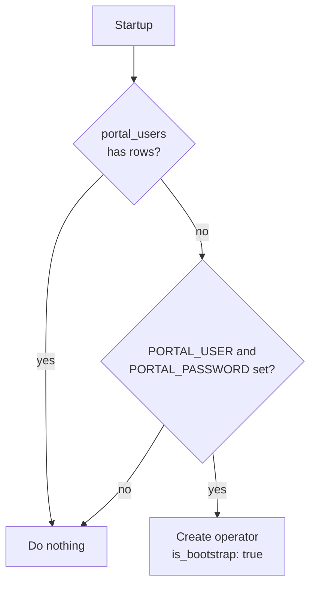

# Operator portal

Prefix: `/api/portal`

*Operators* are the people who administer the service. They are not end users: they have no
biometrics, they authenticate with username and password, and their token opens the whole
API.

---

## Authenticate

```http
POST /api/portal/auth
```

**Scope:** none — this is the **only** open route under `/api/`
**Format:** `application/json`

```json
{"username": "admin", "password": "your-password"}
```

```json
{
  "access_token": "eyJhbGciOiJIUzI1NiIs...",
  "token_type": "bearer",
  "expires_in": 3600,
  "username": "admin",
  "uuid": "b7d2..."
}
```

The token carries `scope: "portal"` and lasts `JWT_EXPIRE_MINUTES`.

| Code | When |
| --- | --- |
| 401 | Wrong credentials or a disabled account |
| 429 | Too many attempts from that IP |

!!! note "Constant-time comparison"
    If the user does not exist, verification still runs against a filler hash. That way
    response time does not reveal whether the name is registered.

---

## Who am I

```http
GET /api/portal/me
```

**Authentication:** portal token in `Authorization: Bearer`

```json
{
  "username": "admin",
  "uuid": "b7d2...",
  "scope": "portal",
  "auth": "portal"
}
```

Useful for checking whether the token is still alive, with no side effects.

---

## Cold start

At startup, if the `portal_users` table is **empty**, the service creates an operator from
`PORTAL_USER` and `PORTAL_PASSWORD` and marks it `is_bootstrap: true`.



!!! warning "Change the bootstrap password"
    While `is_bootstrap` stays `true`, the account uses the password written in the `.env`
    file. Changing it from the portal flips the flag to `false`. Do it on first access.

---

## List operators

```http
GET /api/portal/users
```

**Scope:** `admin`

```json
[
  {
    "uuid": "b7d2...",
    "username": "admin",
    "active": true,
    "is_bootstrap": false,
    "created_at": "2026-08-01T09:00:00",
    "last_login_at": "2026-08-16T14:03:12"
  }
]
```

---

## Create an operator

```http
POST /api/portal/users
```

**Scope:** `admin` · **Format:** `application/json` · **Response:** `201`

```json
{"username": "supervisor", "password": "a-password-of-8-or-more"}
```

| Field | Requirement |
| --- | --- |
| `username` | 3 to 100 characters, unique |
| `password` | **8** to 256 characters |

**409** if the name already exists.

!!! note "Operators require 8 characters, end users 6"
    This is not an inconsistency: an operator administers the whole service, while an end
    user only accesses their own account and usually has biometrics as well.

---

## Disable an operator

```http
POST /api/portal/users/{user_uuid}/disable
```

**Scope:** `admin`

```json
{"disabled": "b7d2...", "username": "supervisor"}
```

| Code | When |
| --- | --- |
| 404 | The operator does not exist |
| 409 | It is the **last** active operator |

!!! tip "Lockout protection"
    The service refuses to disable the last active operator. Without that check, nobody
    could get back in to administer: `PORTAL_USER` only acts when the table is empty, and
    disabling does not delete the row.

Operators are not deleted, they are disabled. A disabled operator gets 401 on
authentication, and their history is preserved.

---

## Change the password

```http
POST /api/portal/users/{user_uuid}/password
```

**Scope:** `admin` · **Format:** `application/json`

```json
{"current_password": "the-current-one", "new_password": "the-new-one-8-plus"}
```

```json
{"username": "admin", "message": "Contrasena actualizada"}
```

The current password is required even when the caller is an administrator. On change,
`is_bootstrap` becomes `false`.

| Code | When |
| --- | --- |
| 401 | The current password is wrong |
| 404 | The operator does not exist |

---

## End-user password login

```http
POST /api/auth/login
```

**Scope:** `auth` · **Format:** `application/json`

It does not belong to the portal, but it is worth distinguishing: it authenticates an **end
user** with the password stored on their account.

```json
{"username": "ana", "password": "their-password"}
```

```json
{
  "access_token": "eyJhbGciOiJIUzI1NiIs...",
  "token_type": "bearer",
  "expires_in": 900
}
```

It issues a **session** token (`scope: "user"`, `method: "password"`), not a portal token.
It cannot be used to call `/api/*`.

| Code | When |
| --- | --- |
| 401 | Unknown user, no password set, or wrong password |
| 429 | Too many attempts for that IP and user |

All three 401 cases return the same message and take the same time: nothing leaks about
whether the account exists.
