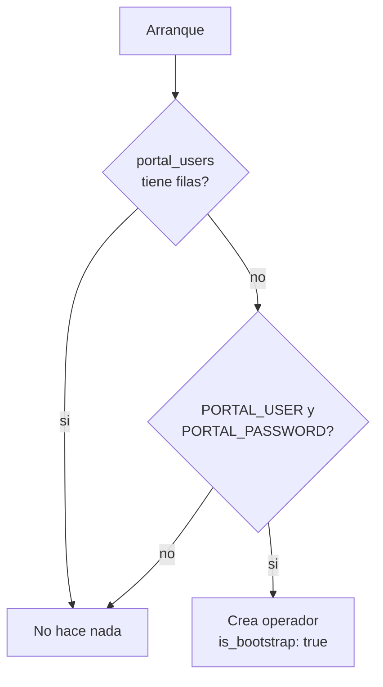

# Portal de operadores

Prefijo: `/api/portal`

Los *operadores* son las personas que administran el servicio. No son usuarios finales: no
tienen biometria, se autentican con usuario y contrasena, y su token abre toda la API.

---

## Autenticarse

```http
POST /api/portal/auth
```

**Permiso:** ninguno — es la **unica** ruta abierta bajo `/api/`
**Formato:** `application/json`

```json
{"username": "admin", "password": "tu-clave"}
```

```json
{
  "access_token": "eyJhbGciOiJIUzI1NiIs...",
  "token_type": "bearer",
  "expires_in": 3600,
  "username": "admin",
  "uuid": "b7d2..."
}
```

El token tiene `scope: "portal"` y dura `JWT_EXPIRE_MINUTES`.

| Codigo | Cuando |
| --- | --- |
| 401 | Credenciales incorrectas o cuenta desactivada |
| 429 | Demasiados intentos desde esa IP |

!!! note "Comparacion en tiempo constante"
    Si el usuario no existe, se verifica igualmente contra un hash de relleno. Asi el
    tiempo de respuesta no revela si el nombre esta registrado.

---

## Quien soy

```http
GET /api/portal/me
```

**Autenticacion:** token de portal en `Authorization: Bearer`

```json
{
  "username": "admin",
  "uuid": "b7d2...",
  "scope": "portal",
  "auth": "portal"
}
```

Sirve para comprobar si el token sigue vivo sin efectos secundarios.

---

## Arranque en frio

Al iniciarse, si la tabla `portal_users` esta **vacia**, el servicio crea un operador con
`PORTAL_USER` y `PORTAL_PASSWORD` y lo marca `is_bootstrap: true`.



!!! warning "Cambia la contrasena de arranque"
    Mientras `is_bootstrap` siga en `true`, la cuenta usa la contrasena que esta escrita en
    el `.env`. Cambiarla desde el portal pone la marca en `false`. Hazlo en el primer
    acceso.

---

## Listar operadores

```http
GET /api/portal/users
```

**Permiso:** `admin`

```json
[
  {
    "uuid": "b7d2...",
    "username": "admin",
    "active": true,
    "is_bootstrap": false,
    "created_at": "2026-08-01T09:00:00",
    "last_login_at": "2026-08-16T14:03:12"
  }
]
```

---

## Crear un operador

```http
POST /api/portal/users
```

**Permiso:** `admin` · **Formato:** `application/json` · **Respuesta:** `201`

```json
{"username": "supervisor", "password": "una-clave-de-8-o-mas"}
```

| Campo | Requisito |
| --- | --- |
| `username` | 3 a 100 caracteres, unico |
| `password` | **8** a 256 caracteres |

**409** si el nombre ya existe.

!!! note "Los operadores exigen 8 caracteres, los usuarios finales 6"
    No es una incoherencia: un operador administra todo el servicio, un usuario final solo
    entra a su cuenta y ademas suele tener biometria.

---

## Desactivar un operador

```http
POST /api/portal/users/{user_uuid}/disable
```

**Permiso:** `admin`

```json
{"disabled": "b7d2...", "username": "supervisor"}
```

| Codigo | Cuando |
| --- | --- |
| 404 | El operador no existe |
| 409 | Es el **ultimo** operador activo |

!!! tip "Proteccion contra quedarse fuera"
    El servicio se niega a desactivar al ultimo operador activo. Sin esa comprobacion,
    nadie podria volver a entrar a administrar: `PORTAL_USER` solo actua cuando la tabla
    esta vacia, y desactivar no borra la fila.

Los operadores no se borran, se desactivan. Un operador inactivo recibe 401 al intentar
autenticarse, y su historial se conserva.

---

## Cambiar la contrasena

```http
POST /api/portal/users/{user_uuid}/password
```

**Permiso:** `admin` · **Formato:** `application/json`

```json
{"current_password": "la-actual", "new_password": "la-nueva-de-8-o-mas"}
```

```json
{"username": "admin", "message": "Contrasena actualizada"}
```

Exige la contrasena actual aunque quien llame sea administrador. Al cambiarla,
`is_bootstrap` pasa a `false`.

| Codigo | Cuando |
| --- | --- |
| 401 | La contrasena actual no es correcta |
| 404 | El operador no existe |

---

## Login de usuario final por contrasena

```http
POST /api/auth/login
```

**Permiso:** `auth` · **Formato:** `application/json`

No pertenece al portal, pero conviene distinguirlo: autentica a un **usuario final** con la
contrasena que tenga en su cuenta.

```json
{"username": "ana", "password": "su-clave"}
```

```json
{
  "access_token": "eyJhbGciOiJIUzI1NiIs...",
  "token_type": "bearer",
  "expires_in": 900
}
```

Emite un token de **sesion** (`scope: "user"`, `method: "password"`), no de portal. No
sirve para llamar a `/api/*`.

| Codigo | Cuando |
| --- | --- |
| 401 | Usuario inexistente, sin contrasena, o contrasena incorrecta |
| 429 | Demasiados intentos para esa IP y usuario |

Los tres casos de 401 devuelven el mismo mensaje y tardan lo mismo: no se filtra si la
cuenta existe.
