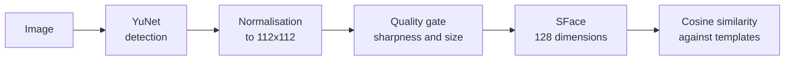
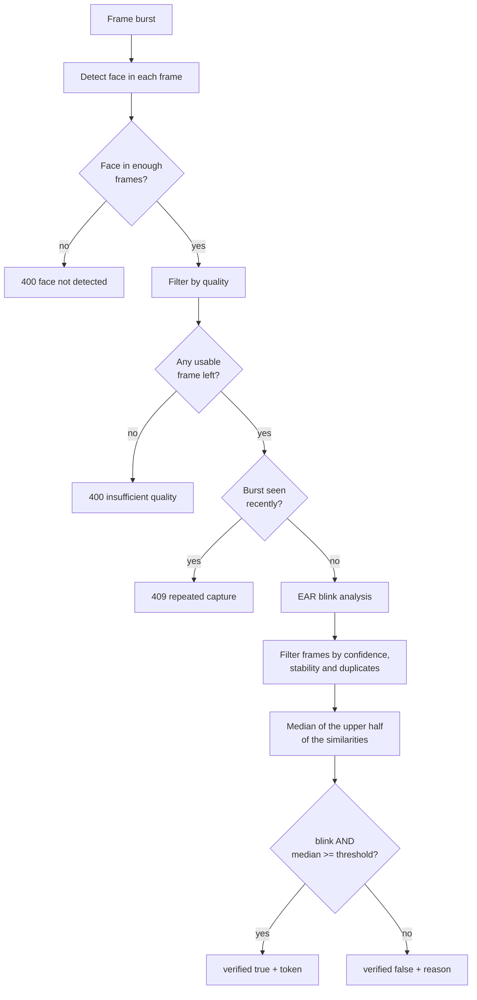

# Face

Prefix: `/api/face`

## How it works



| Stage | Model | Output |
| --- | --- | --- |
| Detection | YuNet 2023-03 | Bounding box and 5 keypoints |
| Embedding | SFace 2021-12 | 128-dimension vector |
| Liveness | OpenSeeFace `lm_model3_opt` | Landmarks for computing the EAR |

The decision is `similarity >= FACE_THRESHOLD`, **0.363** by default.

---

## Register a face and a user together

```http
POST /api/face/register
```

**Scope:** `enroll` · **Format:** `multipart/form-data`

| Field | Type | Required | Description |
| --- | --- | --- | --- |
| `username` | text | yes | 3 to 100 characters |
| `password` | text | no | 6 to 128 characters |
| `image` | file | yes | One photo |

Creates the user **and** their first template. If the user already exists it returns 409:
to add faces to an existing person use
[`POST /api/users/{username}/faces`](usuarios.md#add-photos-to-an-existing-user).

```json
{
  "username": "ana",
  "uuid": "8c1e4f2a-...",
  "algorithm": "sface",
  "message": "Cara registrada correctamente"
}
```

---

## Verify a face (1:1, no liveness)

```http
POST /api/face/verify
```

**Scope:** `auth` · **Format:** `multipart/form-data`

| Field | Description |
| --- | --- |
| `username` | Who to compare against |
| `user_uuid` | Optional. User UUID, to disambiguate when the name exists in several systems (portal only) |
| `image` | A single photo |

```json
{
  "verified": true,
  "username": "ana",
  "uuid": "8c1e4f2a-...",
  "similarity": 0.7412,
  "threshold": 0.363
}
```

!!! danger "This endpoint does not check that a live person is present"
    A printed photo or a phone screen passes `verify` without trouble, and it **issues no
    session token**. It is for internal checks, never as the sole login factor. Use
    `/login` to authenticate.

---

## Face login with liveness detection

```http
POST /api/face/login
```

**Scope:** `auth` · **Format:** `multipart/form-data`

| Field | Type | Description |
| --- | --- | --- |
| `username` | text | Who to compare against |
| `user_uuid` | text | Optional. Same rule as `verify` |
| `frames` | file[] | Burst of images, repeated field |

At least `LIVENESS_MIN_FACES` frames are required (6 by default). The portal captures
around 28 in 2.6 seconds.

### What gets checked



For `verified` to be `true`, **both** conditions must hold: a blink was detected and the
median of the upper half of the similarities clears the threshold. A single lucky frame
does not authenticate: repeated frames are collapsed, and blurry, moving or weakly
detected ones are excluded before scoring.

### Response

```json
{
  "verified": true,
  "username": "ana",
  "uuid": "8c1e4f2a-...",
  "liveness_passed": true,
  "similarity": 0.7412,
  "threshold": 0.363,
  "n_frames": 28,
  "n_faces": 27,
  "n_usable": 24,
  "n_moved": 3,
  "blink_detected": true,
  "borderline": false,
  "access_token": "eyJhbGciOiJIUzI1NiIs...",
  "token_type": "bearer",
  "expires_in": 900,
  "reason": null
}
```

| Field | Meaning |
| --- | --- |
| `n_frames` | Frames received |
| `n_faces` | Frames with a detected face |
| `n_usable` | Stable frames used to measure the blink |
| `n_moved` | Frames discarded for excessive movement or face swap |
| `similarity` | Best similarity after filtering; the decision uses the upper-half median, not this maximum |
| `borderline` | `true` when liveness passed but the capture landed within `0.03` of the threshold: retry with better light |
| `reason` | Human-readable explanation when `verified` is `false` |

### Rejection reasons

`reason` takes one of these values, in this order of priority:

| Situation | Message |
| --- | --- |
| Face detected in few frames | *Solo se te detecto en N de M frames. Mira de frente a la camara sin girar la cabeza durante la captura.* |
| Too much movement | *Hubo demasiado movimiento durante la captura. Quedate quieto y parpadea cuando el portal te lo indique.* |
| No blink | *No se detecto parpadeo. Parpadea cuando el portal te lo indique.* |
| Near the threshold (`borderline`) | *El rostro queda cerca del umbral. Mejora la iluminacion, acercate a la camara y repite la captura.* |
| Identity mismatch | *El rostro no coincide con las plantillas registradas.* |

The first three are capture problems, not identity problems: the right frontend action is
to ask the person to retry, not to deny access.

!!! warning "Low light: the known weak spot"
    Under low illumination the system fails in two different ways. Either YuNet detects no
    face at all and returns 400, or sensor noise compresses the embedding space and
    impostor similarities rise. Measured on this database: an impostor goes from 0.179 in
    good light to 0.326 in low light with noise, against a threshold of 0.363. See
    [Known limitations](../operacion/limitaciones.md#low-light-in-face-login).

---

## 1:N identification

```http
POST /api/face/identify
```

**Scope:** `auth` · **Format:** `multipart/form-data`

| Field | Description |
| --- | --- |
| `image` | One photo, without naming anyone |

Compares against **every** template in the database and returns the best match.

```json
{
  "username": "ana",
  "uuid": "8c1e4f2a-...",
  "similarity": 0.7412,
  "threshold": 0.363
}
```

If nobody clears the threshold, `username` and `uuid` are `null` but `similarity` still
carries the best value found, which helps with diagnosis.

!!! warning "It does not scale and it does not check liveness"
    The search is linear over all templates and runs in Python. It degrades with thousands
    of users; a vector index such as `pgvector` would be required. Also, like `verify`, it
    does not check that a live person is present and **issues no token**. It is a search
    tool, not an authentication method.

**404** if no user has a face template.

---

## Templates

### List

```http
GET /api/face/templates
```

**Scope:** `admin`

```json
[
  {"id": 12, "username": "ana", "algorithm": "sface"},
  {"id": 13, "username": "ana", "algorithm": "sface"}
]
```

### Delete one

```http
DELETE /api/face/templates/{template_id}
```

**Scope:** `admin`

```json
{"deleted": 12}
```

Useful for removing one problematic template without deleting the whole user. **404** if
the id does not exist.

!!! note "If you delete them all"
    A user with no current face templates gets **404** on `verify` and `login`, with the
    message *El usuario no tiene plantilla facial vigente. Vuelve a registrar la cara.*
