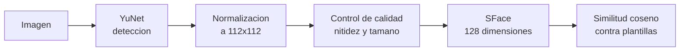
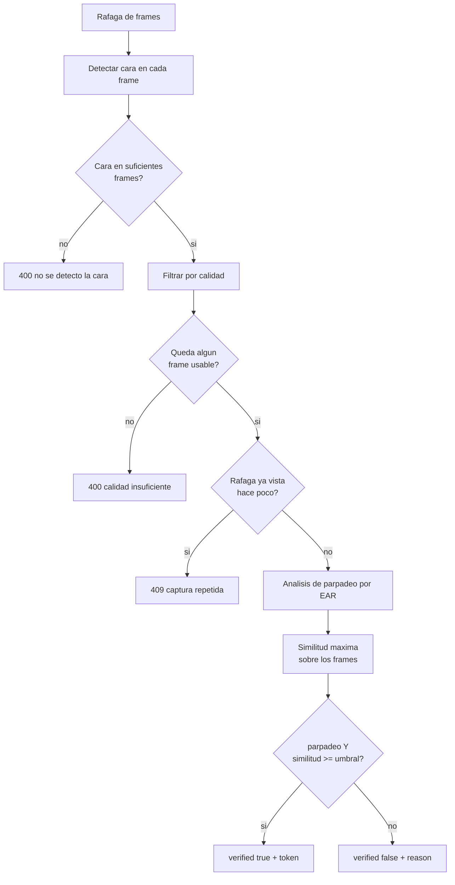

# Rostro

Prefijo: `/api/face`

## Como funciona



| Etapa | Modelo | Salida |
| --- | --- | --- |
| Deteccion | YuNet 2023-03 | Rectangulo y 5 puntos clave |
| Embedding | SFace 2021-12 | Vector de 128 dimensiones |
| Vida | OpenSeeFace `lm_model3_opt` | Puntos faciales para calcular el EAR |

La decision es `similitud >= FACE_THRESHOLD`, por defecto **0.363**.

---

## Registrar cara y usuario a la vez

```http
POST /api/face/register
```

**Permiso:** `enroll` · **Formato:** `multipart/form-data`

| Campo | Tipo | Obligatorio | Descripcion |
| --- | --- | --- | --- |
| `username` | texto | si | 3 a 100 caracteres |
| `password` | texto | no | 6 a 128 caracteres |
| `image` | archivo | si | Una foto |

Crea el usuario **y** su primera plantilla. Si el usuario ya existe devuelve 409: para
anadir caras a alguien existente usa
[`POST /api/users/{username}/faces`](usuarios.md#anadir-fotos-a-un-usuario-existente).

```json
{
  "username": "ana",
  "uuid": "8c1e4f2a-...",
  "algorithm": "sface",
  "message": "Cara registrada correctamente"
}
```

---

## Verificar una cara (1:1, sin deteccion de vida)

```http
POST /api/face/verify
```

**Permiso:** `auth` · **Formato:** `multipart/form-data`

| Campo | Descripcion |
| --- | --- |
| `username` | A quien se compara |
| `image` | Una sola foto |

```json
{
  "verified": true,
  "username": "ana",
  "uuid": "8c1e4f2a-...",
  "similarity": 0.7412,
  "threshold": 0.363
}
```

!!! danger "Este endpoint no comprueba que haya una persona viva"
    Una foto impresa o la pantalla de un movil pasan `verify` sin problema, y ademas **no
    emite token de sesion**. Sirve para comprobaciones internas, nunca como unico factor
    de login. Para autenticar usa `/login`.

---

## Login facial con deteccion de vida

```http
POST /api/face/login
```

**Permiso:** `auth` · **Formato:** `multipart/form-data`

| Campo | Tipo | Descripcion |
| --- | --- | --- |
| `username` | texto | A quien se compara |
| `frames` | archivo[] | Rafaga de imagenes, campo repetido |

Se necesitan al menos `LIVENESS_MIN_FACES` frames (6 por defecto). El portal captura unos
28 en 2.6 segundos.

### Que se comprueba



Para que `verified` sea `true` hacen falta **las dos condiciones**: parpadeo detectado y
similitud sobre el umbral.

### Respuesta

```json
{
  "verified": true,
  "username": "ana",
  "uuid": "8c1e4f2a-...",
  "liveness_passed": true,
  "similarity": 0.7412,
  "threshold": 0.363,
  "n_frames": 28,
  "n_faces": 27,
  "n_usable": 24,
  "n_moved": 3,
  "blink_detected": true,
  "access_token": "eyJhbGciOiJIUzI1NiIs...",
  "token_type": "bearer",
  "expires_in": 900,
  "reason": null
}
```

| Campo | Significado |
| --- | --- |
| `n_frames` | Frames recibidos |
| `n_faces` | Frames con cara detectada |
| `n_usable` | Frames estables usados para medir el parpadeo |
| `n_moved` | Frames descartados por movimiento excesivo |
| `similarity` | **Maximo** sobre todos los frames y todas las plantillas |
| `reason` | Explicacion legible cuando `verified` es `false` |

### Motivos de rechazo

`reason` toma uno de estos valores, en este orden de prioridad:

| Situacion | Mensaje |
| --- | --- |
| Cara detectada en pocos frames | *Solo se te detecto en N de M frames. Mira de frente a la camara sin girar la cabeza durante la captura.* |
| Demasiado movimiento | *Hubo demasiado movimiento durante la captura. Quedate quieto y parpadea cuando el portal te lo indique.* |
| Sin parpadeo | *No se detecto parpadeo. Parpadea cuando el portal te lo indique.* |
| Identidad no coincide | *El rostro no coincide con las plantillas registradas.* |

Los tres primeros son problemas de captura, no de identidad: la accion correcta en el
frontend es pedir que repita, no denegar el acceso.

!!! warning "Poca luz: el punto debil conocido"
    Con iluminacion baja el sistema falla de dos maneras distintas. O bien YuNet no detecta
    ninguna cara y responde 400, o bien el ruido del sensor comprime el espacio de
    embeddings y las similitudes de impostor suben. Medido con esta base: un impostor pasa
    de 0.179 con buena luz a 0.326 con poca luz y ruido, frente a un umbral de 0.363. Ver
    [Limitaciones conocidas](../operacion/limitaciones.md#poca-luz-en-el-login-facial).

---

## Identificacion 1:N

```http
POST /api/face/identify
```

**Permiso:** `auth` · **Formato:** `multipart/form-data`

| Campo | Descripcion |
| --- | --- |
| `image` | Una foto, sin decir de quien |

Compara contra **todas** las plantillas de la base y devuelve la mejor.

```json
{
  "username": "ana",
  "uuid": "8c1e4f2a-...",
  "similarity": 0.7412,
  "threshold": 0.363
}
```

Si nadie supera el umbral, `username` y `uuid` son `null` pero `similarity` sigue trayendo
el mejor valor encontrado, lo que ayuda a diagnosticar.

!!! warning "No escala y no verifica la vida"
    La busqueda es lineal sobre todas las plantillas y se hace en Python. Con miles de
    usuarios se degrada; haria falta un indice vectorial tipo `pgvector`. Ademas, igual que
    `verify`, no comprueba que haya una persona viva y **no emite token**. Es una
    herramienta de busqueda, no de autenticacion.

**404** si no hay ningun usuario con plantilla facial.

---

## Plantillas

### Listar

```http
GET /api/face/templates
```

**Permiso:** `admin`

```json
[
  {"id": 12, "username": "ana", "algorithm": "sface"},
  {"id": 13, "username": "ana", "algorithm": "sface"}
]
```

### Borrar una

```http
DELETE /api/face/templates/{template_id}
```

**Permiso:** `admin`

```json
{"deleted": 12}
```

Util para quitar una plantilla concreta que este dando problemas sin borrar al usuario
entero. **404** si el id no existe.

!!! note "Si borras todas"
    Un usuario sin plantillas faciales vigentes recibe **404** en `verify` y `login`, con
    el mensaje *El usuario no tiene plantilla facial vigente. Vuelve a registrar la cara.*
