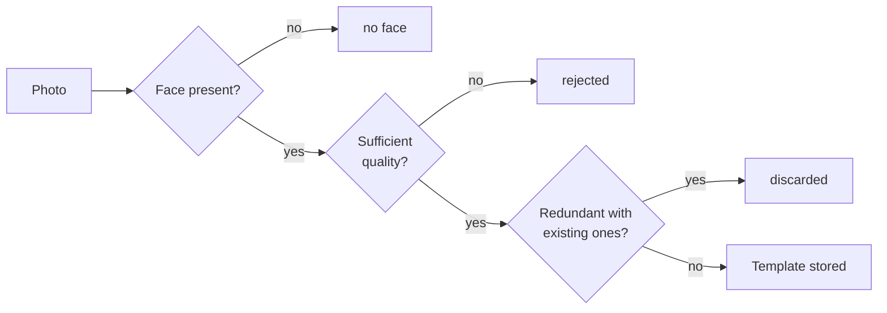

# Users

Prefix: `/api/users`

A user is the identity that biometric templates hang from. It can have face templates
(several), a voice template (one), enrolled digits and a password. Any combination is
valid.

---

## Create a user

```http
POST /api/users/register
```

**Scope:** `enroll` · **Format:** `multipart/form-data`

| Field | Type | Required | Description |
| --- | --- | --- | --- |
| `username` | text | yes | 3 to 100 characters, unique within your system |

!!! note "Per-system names"
    `username` uniqueness is **per API client**: each connected web has its own namespace
    and the same person (or the same name) can exist across several webs without conflict.
    Within a single system the name remains unique.

!!! tip "What to send as `username`"
    Send the identifier your own web already uses for normal login: their username or
    email. Since that value is already unique inside your system it will never collide,
    and users keep one mental credential across both sides. Do not invent new
    identifiers just for this service.
| `password` | text | no | 6 to 128 characters |
| `image` | file | no | One photo |
| `images` | file[] | no | Several photos, repeating the field |
| `audio` | file | no | WAV containing the voice |

**At least one** of the three is required: photo, audio or password. If none arrives, the
response is 400.

```bash
curl -X POST http://localhost:8000/api/users/register \
  -H "X-API-Key: $API_KEY" \
  -F "username=ana" \
  -F "password=a-long-password" \
  -F "images=@a1.jpg" -F "images=@a2.jpg" -F "images=@a3.jpg" \
  -F "audio=@ana.wav"
```

```json
{
  "username": "ana",
  "uuid": "8c1e4f2a-...",
  "has_password": true,
  "face_templates": [
    {"id": 12, "algorithm": "sface"},
    {"id": 13, "algorithm": "sface"}
  ],
  "voice_templates": [
    {"id": 4, "algorithm": "mfcc-gmm", "duration_seconds": 7.3}
  ],
  "digits": [],
  "digits_challenge_ready": false,
  "digits_cmvn_ok": false
}
```

!!! note "Redundant photos"
    Three photos were sent in the example and only two templates were stored: the third was
    nearly identical to another. The service silently discards redundant ones so the
    database does not fill up with vectors that add no variety.

**Possible errors**

| Code | When |
| --- | --- |
| 400 | No biometrics and no password arrived |
| 400 | No photo has a detectable face or sufficient quality |
| 409 | The username already exists (within your system) |
| 409 | The voice is already enrolled on another account (see [Voice](voz.md#duplicate-detection)) |

---

## List users

```http
GET /api/users
```

**Scope:** `admin`

Returns an array with the same object as `register`, one per user. Useful for populating an
administration panel.

Accepts the common listing parameters (`page`, `limit`, `search`, `sort_by`, `sort_dir`)
plus:

| Parameter | Values | Effect |
| --- | --- | --- |
| `owner` | *(empty)* | All systems |
| `owner` | `portal` | Only users created from the portal |
| `owner` | API client UUID | Only users of that system |

An invalid `owner` returns **400**.

```json
[
  {
    "username": "ana",
    "uuid": "8c1e4f2a-...",
    "has_password": true,
    "face_templates": [{"id": 12, "algorithm": "sface"}],
    "voice_templates": [{"id": 4, "algorithm": "mfcc-gmm", "duration_seconds": 7.3}],
    "digits": ["0","1","2","3","4","5","6","7","8","9"],
    "digits_challenge_ready": true,
    "digits_cmvn_ok": true
  }
]
```

| Field | Meaning |
| --- | --- |
| `digits_challenge_ready` | Has enough digits with stored CMVN: can receive challenges |
| `digits_cmvn_ok` | The digit enrolment is from the current version, not an old one |

---

## Look up by UUID

```http
GET /api/users/by-uuid/{user_uuid}
```

**Scope:** `auth`

Same object as above. Intended for client systems that store the UUID rather than the name,
which is the recommended approach: names can change, UUIDs cannot.

**404** if it does not exist.

---

## Add photos to an existing user

```http
POST /api/users/{username}/faces
```

**Scope:** `enroll` · **Format:** `multipart/form-data`

| Field | Type | Description |
| --- | --- | --- |
| `image` | file | One photo |
| `images` | file[] | Several photos |

!!! warning "Accepted formats"
    **JPG** and **PNG** only. Files in other formats (iPhone HEIC/HEIF, AVIF, WEBP)
    cannot be decoded and are ignored; if no photo can be read the response is **400**.

Templates **accumulate**: earlier ones are not deleted. Each photo passes three filters
before being stored.



```json
{
  "username": "ana",
  "uuid": "8c1e4f2a-...",
  "added": 4,
  "redundant": 2,
  "without_face": 1,
  "unreadable": 0,
  "total_templates": 9
}
```

If `added` is 0 the response is **400** with the specific reason: a quality problem, all
redundant, no face detected, or no readable image (unsupported format).

!!! tip "How many photos"
    Between 8 and 12 templates per person, varying expression, angle, glasses and lighting.
    More photos of the same pose do not help: they are discarded as redundant.

---

## Change or remove the password

```http
POST /api/users/{username}/password
```

**Scope:** `admin` · **Format:** `multipart/form-data`

| Field | Description |
| --- | --- |
| `password` | New password, 6 characters or more. **Empty or absent removes it** |

```json
{"username": "ana", "uuid": "8c1e4f2a-...", "has_password": false}
```

Sending the field empty leaves the user with biometrics only. That is intentional, not a
bug.

---

## Rename

```http
POST /api/users/{username}/rename
```

**Scope:** `admin` · **Format:** `multipart/form-data`

| Field | Description |
| --- | --- |
| `new_username` | New name, 3 to 100 characters |

```json
{"username": "ana.gomez", "previous": "ana", "uuid": "8c1e4f2a-..."}
```

**The UUID does not change.** Templates, digits and password are preserved.

| Code | When |
| --- | --- |
| 400 | The new name equals the current one |
| 409 | Another user already has that name |

!!! warning "Store the UUID, not the name"
    If your system references users by name, a rename breaks those references. The UUID is
    stable for the entire lifetime of the account.

---

## Delete

```http
DELETE /api/users/{username}
```

**Scope:** `admin`

Deletes the user and, in cascade, their face templates, voice template and enrolled digits.

!!! danger "There is no recycle bin"
    The operation is immediate and permanent. Re-enrolling the person means repeating the
    whole biometric enrolment.
