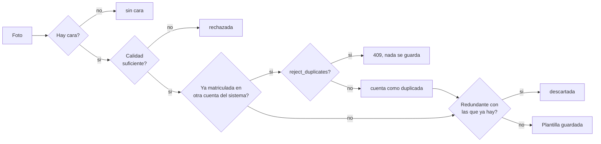

# Usuarios

Prefijo: `/api/users`

Un usuario es la identidad a la que se cuelgan las plantillas biometricas. Puede tener
plantillas faciales (varias), plantilla de voz (una), digitos matriculados y contrasena.
Cualquier combinacion es valida.

---

## Crear un usuario

```http
POST /api/users/register
```

**Permiso:** `enroll` · **Formato:** `multipart/form-data`

| Campo | Tipo | Obligatorio | Descripcion |
| --- | --- | --- | --- |
| `username` | texto | si | 3 a 100 caracteres, unico dentro de tu sistema |

!!! note "Nombres por sistema"
    La unicidad del `username` es **por cliente API**: cada web conectada tiene su propio
    espacio de nombres y la misma persona (o el mismo nombre) puede existir en varias webs
    sin conflicto. Dentro de un mismo sistema, el nombre sigue siendo unico.

!!! tip "Que enviar como `username`"
    Envia el identificador que tu propia web ya usa para el login normal de la persona:
    su nombre de usuario o su correo. Como ese valor ya es unico dentro de tu sistema,
    no colisionara nunca, y el usuario se llevara la misma credencial mental a ambos
    lados. Evita inventar identificadores nuevos solo para este servicio.
| `password` | texto | no | 6 a 128 caracteres |
| `image` | archivo | no | Una foto |
| `images` | archivo[] | no | Varias fotos, repitiendo el campo |
| `audio` | archivo | no | WAV con la voz |

Hace falta **al menos una** de las tres cosas: foto, audio o contrasena. Si no llega
ninguna, la respuesta es 400.

```bash
curl -X POST http://localhost:8000/api/users/register \
  -H "X-API-Key: $API_KEY" \
  -F "username=ana" \
  -F "password=clave-larga" \
  -F "images=@a1.jpg" -F "images=@a2.jpg" -F "images=@a3.jpg" \
  -F "audio=@ana.wav"
```

```json
{
  "username": "ana",
  "uuid": "8c1e4f2a-...",
  "has_password": true,
  "face_templates": [
    {"id": 12, "algorithm": "sface"},
    {"id": 13, "algorithm": "sface"}
  ],
  "voice_templates": [
    {"id": 4, "algorithm": "mfcc-gmm", "duration_seconds": 7.3}
  ],
  "digits": [],
  "digits_challenge_ready": false,
  "digits_cmvn_ok": false
}
```

!!! note "Fotos redundantes"
    En el ejemplo se enviaron tres fotos y solo se guardaron dos plantillas: la tercera era
    casi identica a otra. El servicio descarta las redundantes en silencio para no llenar
    la base de vectores que no aportan variedad.

**Errores posibles**

| Codigo | Cuando |
| --- | --- |
| 400 | No llego ninguna biometria ni contrasena |
| 400 | Ninguna foto tiene cara detectable o suficiente calidad |
| 409 | El nombre de usuario ya existe (dentro de tu sistema) |
| 409 | La voz ya esta matriculada en otra cuenta (ver [Voz](voz.md#control-de-duplicados)) |
| 409 | La cara ya esta matriculada en otra cuenta del mismo sistema (ver [Duplicados](rostro.md#duplicados-dentro-del-mismo-sistema)) |

---

## Listar usuarios

```http
GET /api/users
```

**Permiso:** `admin`

Devuelve un array con el mismo objeto que `register`, uno por usuario. Util para poblar un
panel de administracion.

Acepta los parametros comunes de listado (`page`, `limit`, `search`, `sort_by`, `sort_dir`)
y ademas:

| Parametro | Valores | Efecto |
| --- | --- | --- |
| `owner` | *(vacio)* | Todos los sistemas |
| `owner` | `portal` | Solo usuarios creados desde el portal |
| `owner` | UUID de un cliente API | Solo usuarios de ese sistema |

Con `owner` invalido la respuesta es **400**.

```json
[
  {
    "username": "ana",
    "uuid": "8c1e4f2a-...",
    "has_password": true,
    "face_templates": [{"id": 12, "algorithm": "sface"}],
    "voice_templates": [{"id": 4, "algorithm": "mfcc-gmm", "duration_seconds": 7.3}],
    "digits": ["0","1","2","3","4","5","6","7","8","9"],
    "digits_challenge_ready": true,
    "digits_cmvn_ok": true
  }
]
```

| Campo | Significado |
| --- | --- |
| `digits_challenge_ready` | Tiene digitos suficientes y con CMVN guardada: puede recibir desafios |
| `digits_cmvn_ok` | La matricula de digitos es de la version actual, no una antigua |

---

## Consultar por UUID

```http
GET /api/users/by-uuid/{user_uuid}
```

**Permiso:** `auth`

Mismo objeto que arriba. Pensado para sistemas cliente que guardan el UUID y no el nombre,
que es lo recomendable: el nombre puede cambiar, el UUID no.

**404** si no existe.

---

## Anadir fotos a un usuario existente

```http
POST /api/users/{username}/faces
```

**Permiso:** `enroll` · **Formato:** `multipart/form-data`

| Campo | Tipo | Descripcion |
| --- | --- | --- |
| `image` | archivo | Una foto |
| `images` | archivo[] | Varias fotos |

!!! warning "Formatos aceptados"
    Solo **JPG** y **PNG**. Los archivos en otros formatos (HEIC/HEIF de iPhone, AVIF,
    WEBP) no se pueden decodificar y se ignoran; si ninguna foto se puede leer la
    respuesta es **400**.

Las plantillas se **acumulan** hasta un maximo de `FACE_MAX_TEMPLATES_PER_USER` (12 por
defecto); al alcanzarlo el endpoint responde **400** para que no crezca el coste del
matching. Cada foto pasa por varios filtros antes de guardarse: legible (JPG/PNG), con
cara, con calidad suficiente, no redundante con las que ya hay, y —si la peticion viene
de un cliente API— no estar ya matriculada en otra cuenta del mismo sistema (ver
[duplicados](rostro.md#duplicados-dentro-del-mismo-sistema)).

Con `FACE_REJECT_DUPLICATES=true` (por defecto), una foto duplicada hace fallar **toda la
peticion con 409** y no se guarda nada. Con `false` la foto se guarda igual pero se contabiliza
en `duplicates` (y el campo solo aparece en ese modo).



```json
{
  "username": "ana",
  "uuid": "8c1e4f2a-...",
  "added": 4,
  "redundant": 2,
  "without_face": 1,
  "unreadable": 0,
  "duplicates": 1,
  "limit_reached": false,
  "total_templates": 9
}
```

Si `added` es 0 la respuesta es **400** con el motivo concreto: problema de calidad, todas
redundantes, ninguna cara detectada, ninguna imagen legible (formato no soportado), o el
usuario ya alcanzo el maximo de plantillas.

`limit_reached` se rellena al tocar el tope de `FACE_MAX_TEMPLATES_PER_USER`. El ejemplo
junta `added` con `duplicates` porque presupone `FACE_REJECT_DUPLICATES=false`; con el
valor por defecto `true` esa misma situacion habria devuelto **409** en lugar de esta
respuesta, por lo que `duplicates` no apareceria.

!!! tip "Cuantas fotos"
    Entre 8 y 12 plantillas por persona, variando gesto, angulo, gafas e iluminacion.
    Enviar mas fotos de la misma pose no ayuda: se descartan por redundantes.

---

## Cambiar o quitar la contrasena

```http
POST /api/users/{username}/password
```

**Permiso:** `admin` · **Formato:** `multipart/form-data`

| Campo | Descripcion |
| --- | --- |
| `password` | Nueva contrasena, 6 caracteres o mas. **Vacio o ausente la elimina** |

```json
{"username": "ana", "uuid": "8c1e4f2a-...", "has_password": false}
```

Enviar el campo vacio deja al usuario solo con biometria. Es intencionado, no un error.

---

## Renombrar

```http
POST /api/users/{username}/rename
```

**Permiso:** `admin` · **Formato:** `multipart/form-data`

| Campo | Descripcion |
| --- | --- |
| `new_username` | Nombre nuevo, 3 a 100 caracteres |

```json
{"username": "ana.gomez", "previous": "ana", "uuid": "8c1e4f2a-..."}
```

**El UUID no cambia.** Las plantillas, digitos y contrasena se conservan.

| Codigo | Cuando |
| --- | --- |
| 400 | El nombre nuevo es igual al actual |
| 409 | Ya existe otro usuario con ese nombre |

!!! warning "Guarda el UUID, no el nombre"
    Si tu sistema referencia usuarios por nombre, un renombrado le rompe las referencias.
    El UUID es estable durante toda la vida de la cuenta.

---

## Borrar

```http
DELETE /api/users/{username}
```

**Permiso:** `admin`

Borra el usuario y, en cascada, sus plantillas faciales, su plantilla de voz y sus digitos
matriculados.

!!! danger "No hay papelera"
    La operacion es inmediata y definitiva. Volver a dar de alta a la persona exige
    repetir toda la matricula biometrica.
