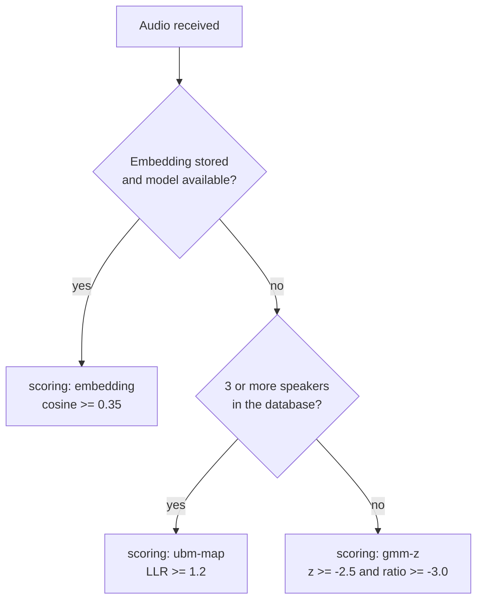
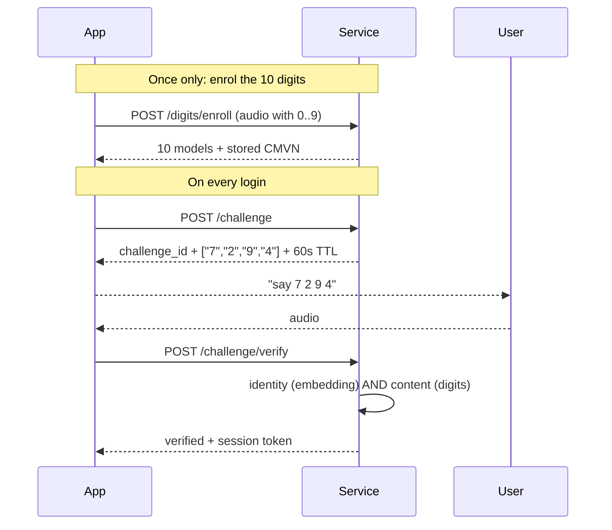

# Voice

Prefix: `/api/voice`

## The three scoring modes

The service automatically picks the best available method. The response always states which
one was used, in the `scoring` field.

| `scoring` | When it is used | Quality |
| --- | --- | --- |
| `embedding` | The user has an embedding and the model is downloaded | **The good one.** ResNet34, 256 dimensions, background population included |
| `ubm-map` | No embedding, but 3 or more speakers in the database | Acceptable. MAP-adapted GMM against a UBM |
| `gmm-z` | No embedding and fewer than 3 speakers | **Insufficient.** See the warning below |



!!! danger "If you see `scoring: \"gmm-z\"`, you are not verifying"
    Measured with real data, an impostor scored `z = -2.444` against the `-2.5` threshold:
    it missed by 0.056. Under MAP adaptation that z-score yields **50.4% EER**, a coin
    flip. Check the state with [`GET /api/voice/system`](#voice-system-status) and fix
    it before exposing the service.

---

## Enrol a voice

```http
POST /api/voice/register
```

**Scope:** `enroll` · **Format:** `multipart/form-data`

| Field | Description |
| --- | --- |
| `username` | An existing user |
| `audio` | WAV with continuous speech |

Replaces any previous template. Each user has exactly one.

```json
{
  "username": "ana",
  "uuid": "8c1e4f2a-...",
  "algorithm": "mfcc-gmm",
  "n_components": 16,
  "duration_seconds": 7.3,
  "n_frames": 682,
  "message": "Voz registrada correctamente",
  "duplicate_of": null,
  "duplicate_similarity": null
}
```

**Audio requirements**

| Aspect | Recommendation |
| --- | --- |
| Duration | 5 seconds or more of actual speech |
| Format | WAV (resampled to 16 kHz mono) |
| Content | Continuous speech, not silence or music |
| Level | Above -55 dBFS |

!!! tip "Turn off browser audio processing"
    Chrome applies echo cancellation, noise suppression and automatic gain control by
    default, and all three alter timbre enough to degrade the embedding. Always capture
    with `echoCancellation: false, noiseSuppression: false, autoGainControl: false,
    channelCount: 1`. See [From a frontend](../integracion/frontend.md).

### Duplicate detection

Before storing, the service compares the new voice against every other account.

If any exceeds `VOICE_DUPLICATE_THRESHOLD`:

- with `VOICE_REJECT_DUPLICATES=true` (default) it responds **409**
- with `false` it stores the voice but fills in `duplicate_of` and `duplicate_similarity`

```json
{
  "detail": "Esta voz ya esta matriculada como 'carlos' (similitud 0.916, umbral 0.35). Matricular la misma voz en dos cuentas hace que una sola grabacion abra las dos. ..."
}
```

!!! warning "The classic symptom"
    A system that *accepts anyone* is almost always this: the same voice enrolled on two
    accounts. The system is not wrong, it is right. This check prevents it at the root.

---

## Verify a voice

```http
POST /api/voice/verify
```

**Scope:** `auth` · **Format:** `multipart/form-data`

| Field | Description |
| --- | --- |
| `username` | Who to compare against |
| `audio` | WAV to verify |

```json
{
  "verified": true,
  "username": "ana",
  "uuid": "8c1e4f2a-...",
  "score": 0.6821,
  "z_score": 0.0,
  "ratio": 0.6821,
  "margin": 0.6821,
  "z_threshold": 0.35,
  "ratio_threshold": 0.35,
  "used_cohort": false,
  "scoring": "embedding",
  "n_background_speakers": 0,
  "access_token": "eyJhbGciOiJIUzI1NiIs...",
  "token_type": "bearer",
  "expires_in": 900,
  "reason": null
}
```

The `z_score`, `ratio`, `margin` and `used_cohort` fields exist for compatibility with the
older modes. In `embedding` mode they all repeat the cosine similarity and `used_cohort` is
`false`. **Always check `scoring` before interpreting the numbers.**

!!! danger "Vulnerable to loudspeaker playback"
    This endpoint accepts any audio that sounds like the account holder, including a
    recording played through a speaker. The replay guard only catches identical bytes. For
    real authentication use the [digit challenge](#digit-challenge).

**409** if exactly the same audio is resent within `REPLAY_WINDOW_SECONDS`.

---

## Digit challenge

This is the recommended path. The server picks digits at random **after** the user asks to
sign in, so no recording made earlier can answer it.



With 4 digits out of 10 enrolled there are **5040 ordered combinations**.

### Enrol the digits

```http
POST /api/voice/digits/enroll
```

**Scope:** `enroll` · **Format:** `multipart/form-data`

| Field | Default | Description |
| --- | --- | --- |
| `username` | — | An existing user |
| `digits` | `0,1,2,...,9` | Digits the audio contains, in order, comma separated |
| `audio` | — | WAV with those digits, with a clear pause between each |

```json
{
  "username": "ana",
  "digits": ["0","1","2","3","4","5","6","7","8","9"],
  "n_segments": 10,
  "frames_per_digit": {"0": 42, "1": 38, "2": 45},
  "duration_seconds": 18.4,
  "message": "Digitos matriculados correctamente"
}
```

The service segments the audio by energy and requires finding **exactly** as many
utterances as declared digits.

| Code | When |
| --- | --- |
| 400 | Invalid or repeated digit list |
| 400 | Detected utterance count does not match the digit count |
| 400 | Some digit is too short |

!!! note "Why the CMVN is stored"
    Cepstral normalisation is computed over the whole recording. If enrolment computes it
    over 10 digits and the challenge over 4, the figures are not comparable and legitimate
    challenges fail: **7 out of 20 failures** were measured with identical audio. That is
    why the enrolment CMVN is stored and imposed at verification time. An enrolment
    predating this change has `cmvn_ok: false` and must be repeated.

`scripts/record_digits.py` guides the recording step by step.

### Check the status

```http
GET /api/voice/digits/{username}
```

**Scope:** `auth`

```json
{
  "username": "ana",
  "enrolled": ["0","1","2","3","4","5","6","7","8","9"],
  "missing": [],
  "cmvn_ok": true,
  "ready": true,
  "needed": 5
}
```

`ready` is `true` when there are at least `needed` digits (`VOICE_CHALLENGE_DIGITS + 1`) and
the CMVN is stored.

### Delete the digits

```http
DELETE /api/voice/digits/{username}
```

**Scope:** `admin`

```json
{"username": "ana", "deleted": 10}
```

### Request a challenge

```http
POST /api/voice/challenge
```

**Scope:** `auth` · **Format:** `multipart/form-data`

| Field | Description |
| --- | --- |
| `username` | Who wants to sign in |

```json
{
  "challenge_id": "7d2f9a1cX...",
  "username": "ana",
  "digits": ["7", "2", "9", "4"],
  "expires_in": 60,
  "instructions": "Di en voz alta estos digitos en este orden, con una pausa breve entre cada uno, y envia la grabacion a /api/voice/challenge/verify."
}
```

The digits are chosen with `secrets.SystemRandom`, not the ordinary random generator.

| Code | When |
| --- | --- |
| 404 | The user has no voice template |
| 409 | Fewer than `VOICE_CHALLENGE_DIGITS + 1` digits enrolled |
| 409 | Digit enrolment is old and has no CMVN |
| 429 | Too many attempts |

### Answer the challenge

```http
POST /api/voice/challenge/verify
```

**Scope:** `auth` · **Format:** `multipart/form-data`

| Field | Description |
| --- | --- |
| `username` | The same one from the challenge |
| `challenge_id` | The token received |
| `audio` | WAV with the requested digits |

```json
{
  "verified": true,
  "username": "ana",
  "uuid": "8c1e4f2a-...",
  "identity_ok": true,
  "content_ok": true,
  "expected": ["7", "2", "9", "4"],
  "recognised": ["7", "2", "9", "4"],
  "n_segments": 4,
  "n_errors": 0,
  "min_margin": 1.842,
  "score": 0.681,
  "scoring": "embedding",
  "n_background_speakers": 0,
  "access_token": "eyJhbGciOiJIUzI1NiIs...",
  "expires_in": 900,
  "reason": null
}
```

**Two independent things** are checked:

| Field | Question it answers |
| --- | --- |
| `identity_ok` | Is this the account holder's voice? |
| `content_ok` | Did they say the right digits, with enough margin? |

`verified` is `identity_ok AND content_ok`. An unrecognised digit appears as `"?"` in
`recognised`.

!!! danger "The challenge is single use"
    Consuming it deletes it from the database, whether it succeeds or fails. A second
    attempt with the same `challenge_id` returns **409** and a new one must be requested.
    Your frontend must request a fresh challenge on every retry.

| Code | When |
| --- | --- |
| 400 | The audio cannot be processed |
| 404 | The user has no voice template |
| 409 | Invalid, expired or already used challenge |
| 409 | The user has no enrolled digits |
| 429 | Too many attempts |

---

## 1:N identification

```http
POST /api/voice/identify
```

**Scope:** `auth` · **Format:** `multipart/form-data`

| Field | Description |
| --- | --- |
| `audio` | WAV, without naming anyone |

```json
{
  "username": "ana",
  "similarity": 0.6821,
  "threshold": 0.35,
  "matches": ["ana"],
  "ambiguous": false,
  "ranking": [
    {"username": "ana", "similarity": 0.6821},
    {"username": "luis", "similarity": 0.1204}
  ]
}
```

| Field | Meaning |
| --- | --- |
| `matches` | Every account clearing the threshold |
| `ambiguous` | `true` if more than one clears it: a sign of duplicated voices |
| `ranking` | The top 5, whether or not they clear the threshold |

An excellent diagnostic tool: `ambiguous: true` means two accounts share a voice. **503** if
the speaker model is not downloaded.

---

## Voice system status

```http
GET /api/voice/system
```

**Scope:** `admin`

```json
{
  "embedding_model": true,
  "embedding_threshold": 0.35,
  "voice_users": 4,
  "users_with_embedding": 4,
  "users_without_embedding": 0,
  "scoring_active": "embedding",
  "needs_more_speakers": false,
  "ubm_min_users": 3,
  "ubm_ready": true,
  "challenge_digits": 4,
  "challenge_min_enrolled": 5
}
```

| Field | Meaning |
| --- | --- |
| `embedding_model` | The speaker ONNX is downloaded |
| `users_with_embedding` | Accounts with an embedding of the current dimension |
| `users_without_embedding` | Accounts falling back to the legacy path |
| `scoring_active` | The mode actually in use |
| `needs_more_speakers` | `true` if not everyone is in `embedding` mode |

!!! tip "This is the first check after a deployment"
    If `scoring_active` is not `"embedding"`, voice verification is **not** at the level you
    think. `users_without_embedding > 0` means those people must re-record their voice from
    the portal.

---

## Voice templates

### List

```http
GET /api/voice/templates
```

**Scope:** `admin`

### Delete one

```http
DELETE /api/voice/templates/{template_id}
```

**Scope:** `admin`

```json
{"deleted": 4}
```
