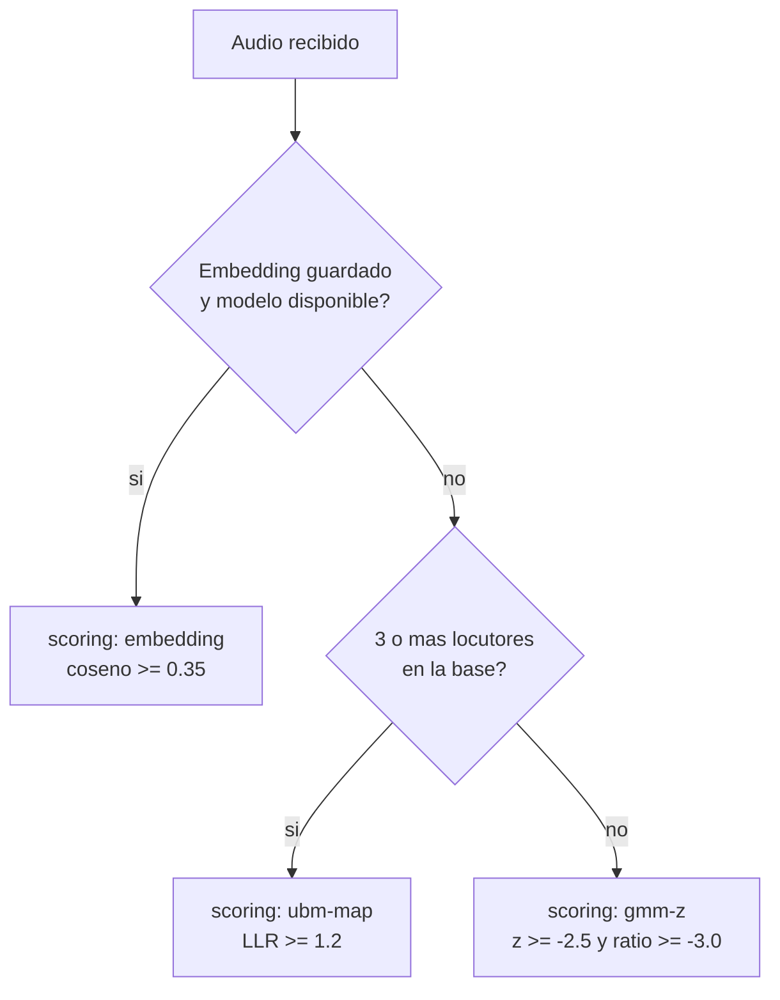
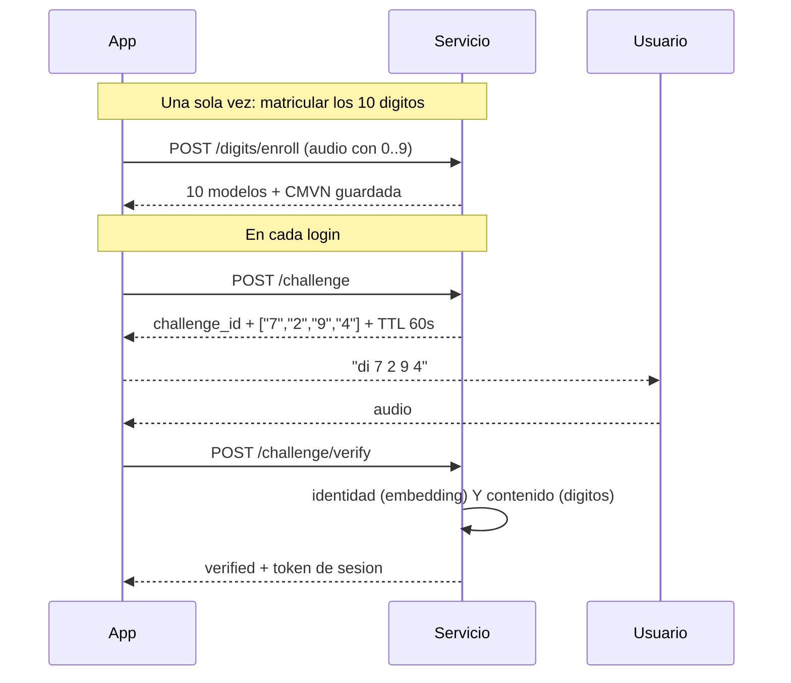

# Voz

Prefijo: `/api/voice`

## Los tres modos de puntuacion

El servicio elige automaticamente el mejor metodo disponible. La respuesta siempre dice
cual se uso, en el campo `scoring`.

| `scoring` | Cuando se usa | Calidad |
| --- | --- | --- |
| `embedding` | El usuario tiene embedding y el modelo esta descargado | **La buena.** ResNet34, 256 dimensiones, poblacion de fondo incluida |
| `ubm-map` | Sin embedding, pero hay 3 o mas locutores en la base | Aceptable. GMM adaptado por MAP contra un UBM |
| `gmm-z` | Sin embedding y con menos de 3 locutores | **Insuficiente.** Ver el aviso de abajo |



!!! danger "Si ves `scoring: \"gmm-z\"`, no estas verificando"
    Medido con datos reales, un impostor puntuo `z = -2.444` frente al umbral de `-2.5`:
    fallo por 0.056. Bajo adaptacion MAP ese z-score da un **50.4% de EER**, una moneda al
    aire. Comprueba el estado con [`GET /api/voice/system`](#estado-del-sistema-de-voz) y
    corrigelo antes de exponer el servicio.

---

## Matricular una voz

```http
POST /api/voice/register
```

**Permiso:** `enroll` · **Formato:** `multipart/form-data`

| Campo | Descripcion |
| --- | --- |
| `username` | Usuario ya existente |
| `audio` | WAV con habla continua |

Sustituye la plantilla anterior si la habia. Cada usuario tiene una sola.

```json
{
  "username": "ana",
  "uuid": "8c1e4f2a-...",
  "algorithm": "mfcc-gmm",
  "n_components": 16,
  "duration_seconds": 7.3,
  "n_frames": 682,
  "message": "Voz registrada correctamente",
  "duplicate_of": null,
  "duplicate_similarity": null
}
```

**Requisitos del audio**

| Aspecto | Recomendacion |
| --- | --- |
| Duracion | 5 segundos o mas de habla real |
| Formato | WAV (se remuestrea a 16 kHz mono) |
| Contenido | Habla continua, no silencio ni musica |
| Nivel | Por encima de -55 dBFS |

!!! tip "Desactiva el procesado del navegador"
    Chrome aplica cancelacion de eco, supresion de ruido y control automatico de ganancia
    por defecto, y los tres alteran el timbre lo bastante como para degradar el embedding.
    Captura siempre con `echoCancellation: false, noiseSuppression: false,
    autoGainControl: false, channelCount: 1`. Ver
    [Desde un frontend](../integracion/frontend.md).

### Control de duplicados

Antes de guardar, el servicio compara la voz nueva contra las de todas las demas cuentas.

Si alguna supera `VOICE_DUPLICATE_THRESHOLD`:

- con `VOICE_REJECT_DUPLICATES=true` (por defecto) responde **409**
- con `false` la guarda, pero rellena `duplicate_of` y `duplicate_similarity`

```json
{
  "detail": "Esta voz ya esta matriculada como 'carlos' (similitud 0.916, umbral 0.35). Matricular la misma voz en dos cuentas hace que una sola grabacion abra las dos. ..."
}
```

!!! warning "El sintoma clasico"
    Que el sistema *acepte a cualquiera* casi siempre es esto: la misma voz matriculada en
    dos cuentas. El sistema no se equivoca, esta acertando. Este control lo impide de raiz.

---

## Verificar una voz

```http
POST /api/voice/verify
```

**Permiso:** `auth` · **Formato:** `multipart/form-data`

| Campo | Descripcion |
| --- | --- |
| `username` | A quien se compara |
| `user_uuid` | Opcional. UUID del usuario, para desambiguar cuando el nombre existe en varios sistemas (solo portal) |
| `audio` | WAV a verificar |

```json
{
  "verified": true,
  "username": "ana",
  "uuid": "8c1e4f2a-...",
  "score": 0.6821,
  "z_score": 0.0,
  "ratio": 0.6821,
  "margin": 0.6821,
  "z_threshold": 0.35,
  "ratio_threshold": 0.35,
  "used_cohort": false,
  "scoring": "embedding",
  "n_background_speakers": 0,
  "access_token": "eyJhbGciOiJIUzI1NiIs...",
  "token_type": "bearer",
  "expires_in": 900,
  "reason": null
}
```

Los campos `z_score`, `ratio`, `margin` y `used_cohort` existen por compatibilidad con los
modos antiguos. En modo `embedding` todos repiten la similitud coseno y `used_cohort` es
`false`. **Mira siempre `scoring` antes de interpretar los numeros.**

!!! danger "Vulnerable a reproduccion por altavoz"
    Este endpoint acepta cualquier audio que suene como el titular, incluida una grabacion
    reproducida por un altavoz. El anti-replay solo detecta el reenvio de bytes identicos.
    Para autenticacion real usa el [desafio de digitos](#desafio-de-digitos).

**409** si se reenvia exactamente el mismo audio dentro de `REPLAY_WINDOW_SECONDS`.

---

## Desafio de digitos

Es la via recomendada. El servidor elige digitos al azar **despues** de que el usuario
pida entrar, asi que ninguna grabacion hecha antes puede responder.



Con 4 digitos sobre 10 matriculados hay **5040 combinaciones ordenadas**.

### Matricular los digitos

```http
POST /api/voice/digits/enroll
```

**Permiso:** `enroll` · **Formato:** `multipart/form-data`

| Campo | Por defecto | Descripcion |
| --- | --- | --- |
| `username` | — | Usuario existente |
| `digits` | `0,1,2,...,9` | Digitos que contiene el audio, en orden, separados por comas |
| `audio` | — | WAV con esos digitos, con pausa clara entre cada uno |

```json
{
  "username": "ana",
  "digits": ["0","1","2","3","4","5","6","7","8","9"],
  "n_segments": 10,
  "frames_per_digit": {"0": 42, "1": 38, "2": 45},
  "duration_seconds": 18.4,
  "message": "Digitos matriculados correctamente"
}
```

El servicio segmenta el audio por energia y exige encontrar **exactamente** tantas
locuciones como digitos declarados.

| Codigo | Cuando |
| --- | --- |
| 400 | Lista de digitos invalida o con repetidos |
| 400 | El numero de locuciones detectadas no coincide con el de digitos |
| 400 | Algun digito es demasiado breve |

!!! note "Por que se guarda la CMVN"
    La normalizacion cepstral se calcula sobre toda la grabacion. Si en la matricula se
    calcula sobre 10 digitos y en el desafio sobre 4, las cifras no son comparables y
    fallan desafios legitimos: se midieron **7 de 20 fallos** con audio identico. Por eso
    la CMVN de la matricula se guarda y se impone al verificar. Una matricula anterior a
    este cambio tiene `cmvn_ok: false` y hay que repetirla.

`scripts/record_digits.py` guia la grabacion paso a paso.

### Consultar el estado

```http
GET /api/voice/digits/{username}
```

**Permiso:** `auth`

```json
{
  "username": "ana",
  "enrolled": ["0","1","2","3","4","5","6","7","8","9"],
  "missing": [],
  "cmvn_ok": true,
  "ready": true,
  "needed": 5
}
```

`ready` es `true` cuando hay al menos `needed` digitos (`VOICE_CHALLENGE_DIGITS + 1`) y la
CMVN esta guardada.

### Borrar los digitos

```http
DELETE /api/voice/digits/{username}
```

**Permiso:** `admin`

```json
{"username": "ana", "deleted": 10}
```

### Pedir un desafio

```http
POST /api/voice/challenge
```

**Permiso:** `auth` · **Formato:** `multipart/form-data`

| Campo | Descripcion |
| --- | --- |
| `username` | Quien quiere entrar |
| `user_uuid` | Opcional. Mismo criterio que en `verify` |

```json
{
  "challenge_id": "7d2f9a1cX...",
  "username": "ana",
  "digits": ["7", "2", "9", "4"],
  "expires_in": 60,
  "instructions": "Di en voz alta estos digitos en este orden, con una pausa breve entre cada uno, y envia la grabacion a /api/voice/challenge/verify."
}
```

Los digitos se eligen con `secrets.SystemRandom`, no con el generador aleatorio normal.

| Codigo | Cuando |
| --- | --- |
| 404 | El usuario no tiene plantilla de voz |
| 409 | Tiene menos de `VOICE_CHALLENGE_DIGITS + 1` digitos matriculados |
| 409 | La matricula de digitos es antigua y no tiene CMVN |
| 429 | Demasiados intentos |

### Responder al desafio

```http
POST /api/voice/challenge/verify
```

**Permiso:** `auth` · **Formato:** `multipart/form-data`

| Campo | Descripcion |
| --- | --- |
| `username` | El mismo del desafio |
| `user_uuid` | Opcional. Mismo criterio que en `verify` |
| `challenge_id` | El token recibido |
| `audio` | WAV con los digitos pedidos |

```json
{
  "verified": true,
  "username": "ana",
  "uuid": "8c1e4f2a-...",
  "identity_ok": true,
  "content_ok": true,
  "expected": ["7", "2", "9", "4"],
  "recognised": ["7", "2", "9", "4"],
  "n_segments": 4,
  "n_errors": 0,
  "min_margin": 1.842,
  "score": 0.681,
  "scoring": "embedding",
  "n_background_speakers": 0,
  "access_token": "eyJhbGciOiJIUzI1NiIs...",
  "expires_in": 900,
  "reason": null
}
```

Se comprueban **dos cosas independientes**:

| Campo | Pregunta que responde |
| --- | --- |
| `identity_ok` | Es la voz del titular? |
| `content_ok` | Dijo los digitos correctos, con margen suficiente? |

`verified` es `identity_ok AND content_ok`. Un digito no reconocido aparece como `"?"` en
`recognised`.

!!! danger "El desafio es de un solo uso"
    Consumirlo lo borra de la base, acierte o falle. Un segundo intento con el mismo
    `challenge_id` devuelve **409** y hay que pedir uno nuevo. Tu frontend debe pedir
    desafio nuevo en cada reintento.

| Codigo | Cuando |
| --- | --- |
| 400 | El audio no se puede procesar |
| 404 | El usuario no tiene plantilla de voz |
| 409 | Desafio invalido, caducado o ya usado |
| 409 | El usuario no tiene digitos matriculados |
| 429 | Demasiados intentos |

---

## Identificacion 1:N

```http
POST /api/voice/identify
```

**Permiso:** `auth` · **Formato:** `multipart/form-data`

| Campo | Descripcion |
| --- | --- |
| `audio` | WAV, sin decir de quien |

```json
{
  "username": "ana",
  "similarity": 0.6821,
  "threshold": 0.35,
  "matches": ["ana"],
  "ambiguous": false,
  "ranking": [
    {"username": "ana", "similarity": 0.6821},
    {"username": "luis", "similarity": 0.1204}
  ]
}
```

| Campo | Significado |
| --- | --- |
| `matches` | Todas las cuentas que superan el umbral |
| `ambiguous` | `true` si mas de una lo supera: senal de voces duplicadas |
| `ranking` | Las 5 mejores, superen o no el umbral |

Herramienta de diagnostico excelente: `ambiguous: true` indica que dos cuentas comparten
voz. **503** si el modelo de locutor no esta descargado.

---

## Estado del sistema de voz

```http
GET /api/voice/system
```

**Permiso:** `admin`

```json
{
  "embedding_model": true,
  "embedding_threshold": 0.35,
  "voice_users": 4,
  "users_with_embedding": 4,
  "users_without_embedding": 0,
  "scoring_active": "embedding",
  "needs_more_speakers": false,
  "ubm_min_users": 3,
  "ubm_ready": true,
  "challenge_digits": 4,
  "challenge_min_enrolled": 5
}
```

| Campo | Significado |
| --- | --- |
| `embedding_model` | El ONNX de locutor esta descargado |
| `users_with_embedding` | Cuentas con embedding de la dimension actual |
| `users_without_embedding` | Cuentas que caen al camino antiguo |
| `scoring_active` | Modo que se esta usando de verdad |
| `needs_more_speakers` | `true` si no todo el mundo esta en modo `embedding` |

!!! tip "Es la primera comprobacion tras un despliegue"
    Si `scoring_active` no es `"embedding"`, la verificacion de voz **no** esta al nivel
    que crees. `users_without_embedding > 0` significa que esas personas deben volver a
    grabar su voz desde el portal.

---

## Plantillas de voz

### Listar

```http
GET /api/voice/templates
```

**Permiso:** `admin`

### Borrar una

```http
DELETE /api/voice/templates/{template_id}
```

**Permiso:** `admin`

```json
{"deleted": 4}
```
