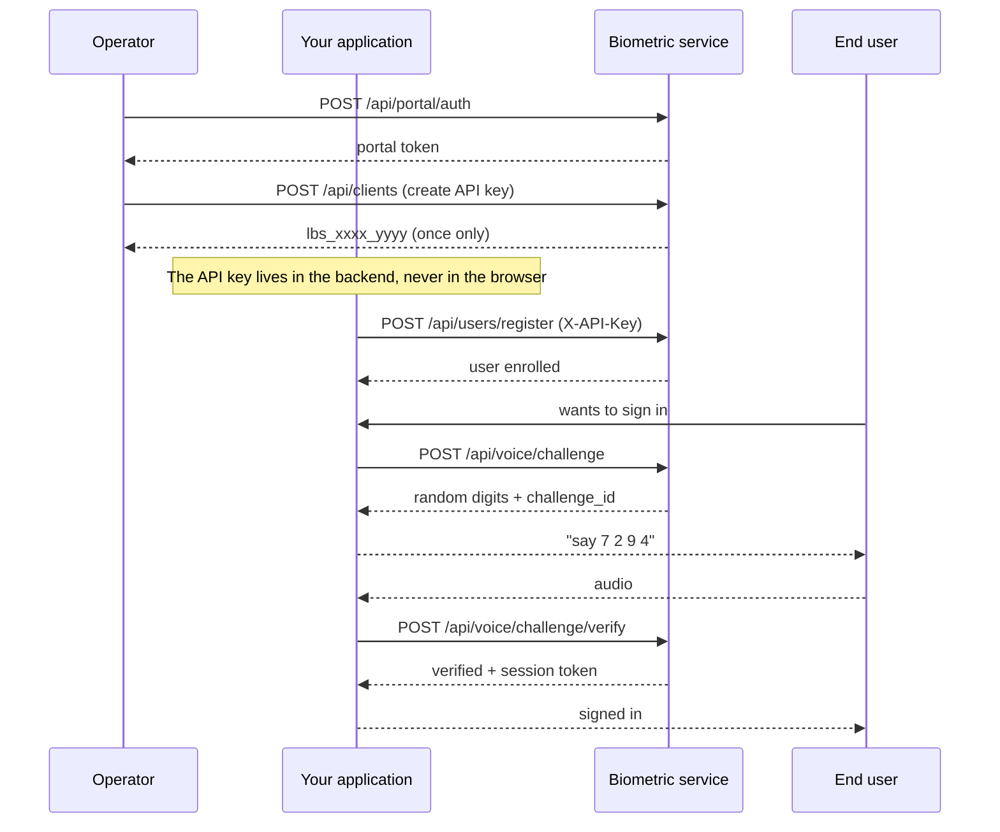

# Quickstart

A complete walkthrough from scratch: create an API key, enrol a person and authenticate
them. All with `curl`, so the protocol is visible in the raw.

---

## 1. Get a portal token

The portal is the only way to create API keys, and it authenticates with username and
password.

```bash
curl -X POST http://localhost:8000/api/portal/auth \
  -H "Content-Type: application/json" \
  -d '{"username": "admin", "password": "YOUR_PASSWORD"}'
```

```json
{
  "access_token": "eyJhbGciOiJIUzI1NiIs...",
  "token_type": "bearer",
  "expires_in": 3600,
  "username": "admin"
}
```

Save the token:

```bash
PORTAL_TOKEN="eyJhbGciOiJIUzI1NiIs..."
```

---

## 2. Create an API key for your system

```bash
curl -X POST http://localhost:8000/api/clients \
  -H "Authorization: Bearer $PORTAL_TOKEN" \
  -H "Content-Type: application/json" \
  -d '{
        "name": "erp-production",
        "scopes": ["auth", "enroll"],
        "expires_in_days": 365
      }'
```

```json
{
  "uuid": "3f9c...",
  "name": "erp-production",
  "scopes": ["auth", "enroll"],
  "expires_at": "2027-08-16T00:00:00",
  "api_key": "lbs_a1b2c3d4_XoP9...",
  "aviso": "Guarda esta API key ahora: no se puede volver a consultar."
}
```

!!! danger "The key is shown exactly once"
    Only an HMAC-SHA256 of the secret is stored. If you lose it, the key must be rotated
    with `POST /api/clients/{uuid}/rotate`.

```bash
API_KEY="lbs_a1b2c3d4_XoP9..."
```

---

## 3. Enrol a person

A user can be created with a face, a voice, a password or any combination. Here, face and
voice in a single call:

```bash
curl -X POST http://localhost:8000/api/users/register \
  -H "X-API-Key: $API_KEY" \
  -F "username=ana" \
  -F "images=@photo1.jpg" \
  -F "images=@photo2.jpg" \
  -F "images=@photo3.jpg" \
  -F "audio=@voice.wav"
```

!!! tip "More photos, better results"
    Send between 5 and 12 photos with different expressions, angles and lighting. The
    service automatically discards any that are nearly identical to one already stored, so
    sending ten copies of the same pose adds nothing.

For the audio: 5 seconds or more of continuous speech, 16 kHz, mono, WAV.

---

## 4. Face login with liveness detection

Face login does **not** accept a single image: it needs a burst in which a blink occurs.

```bash
curl -X POST http://localhost:8000/api/face/login \
  -H "X-API-Key: $API_KEY" \
  -F "username=ana" \
  -F "frames=@f01.jpg" -F "frames=@f02.jpg" -F "frames=@f03.jpg" \
  -F "frames=@f04.jpg" -F "frames=@f05.jpg" -F "frames=@f06.jpg" \
  -F "frames=@f07.jpg" -F "frames=@f08.jpg"
```

```json
{
  "verified": true,
  "username": "ana",
  "uuid": "8c1e...",
  "liveness_passed": true,
  "similarity": 0.7412,
  "threshold": 0.363,
  "n_frames": 8,
  "n_faces": 8,
  "n_usable": 8,
  "n_moved": 0,
  "blink_detected": true,
  "access_token": "eyJhbGciOiJIUzI1NiIs...",
  "token_type": "bearer",
  "expires_in": 900,
  "reason": null
}
```

For `verified` to be `true`, **both** conditions must hold: a blink was detected and
similarity is above the threshold. When it fails, `reason` explains which one.

---

## 5. Voice login with a digit challenge

This is the recommended path, because an earlier recording is useless.

**5.1 Enrol the ten digits** (once per person):

```bash
curl -X POST http://localhost:8000/api/voice/digits/enroll \
  -H "X-API-Key: $API_KEY" \
  -F "username=ana" \
  -F "digits=0,1,2,3,4,5,6,7,8,9" \
  -F "audio=@digits.wav"
```

The audio must contain the ten digits **in that order**, with a clear pause between each
one. `scripts/record_digits.py` guides the recording.

**5.2 Request a challenge:**

```bash
curl -X POST http://localhost:8000/api/voice/challenge \
  -H "X-API-Key: $API_KEY" \
  -F "username=ana"
```

```json
{
  "challenge_id": "7d2f9a1c...",
  "username": "ana",
  "digits": ["7", "2", "9", "4"],
  "expires_in": 60,
  "instructions": "Di en voz alta estos digitos en este orden..."
}
```

**5.3 Answer it:**

```bash
curl -X POST http://localhost:8000/api/voice/challenge/verify \
  -H "X-API-Key: $API_KEY" \
  -F "username=ana" \
  -F "challenge_id=7d2f9a1c..." \
  -F "audio=@answer.wav"
```

```json
{
  "verified": true,
  "username": "ana",
  "identity_ok": true,
  "content_ok": true,
  "expected": ["7", "2", "9", "4"],
  "recognised": ["7", "2", "9", "4"],
  "n_segments": 4,
  "n_errors": 0,
  "scoring": "embedding",
  "access_token": "eyJhbGciOiJIUzI1NiIs...",
  "expires_in": 900
}
```

Two things are checked independently: **`identity_ok`** (is it the account holder's voice)
and **`content_ok`** (did they say the right digits). Both must hold.

---

## 6. Use the session token

The `access_token` returned by any login is a JWT with scope `user`. Your application
validates it with the same `JWT_SECRET` and knows who is present.

```json
{
  "sub": "ana",
  "uid": "8c1e...",
  "scope": "user",
  "method": "face",
  "iat": 1755299100,
  "exp": 1755300000
}
```

The `method` claim says how they authenticated: `face`, `voice`, `voice-challenge` or
`password`. You can require a specific method for sensitive operations.

Details in [Validating the session](../integracion/sesiones.md).

---

## Full flow diagram


