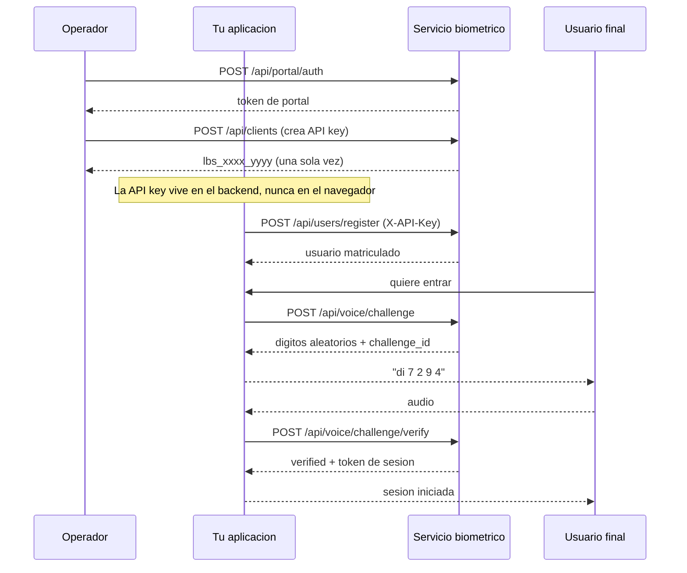

# Primeros pasos

Recorrido completo desde cero: crear una API key, matricular a una persona y autenticarla.
Todo con `curl`, para que se vea el protocolo desnudo.

---

## 1. Obtener un token de portal

El portal es la unica via para crear API keys, y se autentica con usuario y contrasena.

```bash
curl -X POST http://localhost:8000/api/portal/auth \
  -H "Content-Type: application/json" \
  -d '{"username": "admin", "password": "TU_PASSWORD"}'
```

```json
{
  "access_token": "eyJhbGciOiJIUzI1NiIs...",
  "token_type": "bearer",
  "expires_in": 3600,
  "username": "admin"
}
```

Guarda el token:

```bash
PORTAL_TOKEN="eyJhbGciOiJIUzI1NiIs..."
```

---

## 2. Crear una API key para tu sistema

```bash
curl -X POST http://localhost:8000/api/clients \
  -H "Authorization: Bearer $PORTAL_TOKEN" \
  -H "Content-Type: application/json" \
  -d '{
        "name": "erp-produccion",
        "scopes": ["auth", "enroll"],
        "expires_in_days": 365
      }'
```

```json
{
  "uuid": "3f9c...",
  "name": "erp-produccion",
  "scopes": ["auth", "enroll"],
  "expires_at": "2027-08-16T00:00:00",
  "api_key": "lbs_a1b2c3d4_XoP9...",
  "aviso": "Guarda esta API key ahora: no se puede volver a consultar."
}
```

!!! danger "La clave se muestra una sola vez"
    Solo se guarda un HMAC-SHA256 del secreto. Si la pierdes, hay que rotarla con
    `POST /api/clients/{uuid}/rotate`.

```bash
API_KEY="lbs_a1b2c3d4_XoP9..."
```

---

## 3. Matricular a una persona

Un usuario se puede crear con rostro, voz, contrasena o cualquier combinacion. Aqui, cara
y voz en una sola llamada:

```bash
curl -X POST http://localhost:8000/api/users/register \
  -H "X-API-Key: $API_KEY" \
  -F "username=ana" \
  -F "images=@foto1.jpg" \
  -F "images=@foto2.jpg" \
  -F "images=@foto3.jpg" \
  -F "audio=@voz.wav"
```

!!! tip "Varias fotos, mejor resultado"
    Manda entre 5 y 12 fotos con gestos, angulos e iluminaciones distintas. El servicio
    descarta automaticamente las que sean casi identicas a otra ya guardada, asi que
    enviar diez copias de la misma pose no aporta nada.

Para el audio: 5 segundos o mas de habla continua, 16 kHz, mono, WAV.

---

## 4. Login por rostro con deteccion de vida

El login facial **no** acepta una sola imagen: necesita una rafaga en la que se vea un
parpadeo.

```bash
curl -X POST http://localhost:8000/api/face/login \
  -H "X-API-Key: $API_KEY" \
  -F "username=ana" \
  -F "frames=@f01.jpg" -F "frames=@f02.jpg" -F "frames=@f03.jpg" \
  -F "frames=@f04.jpg" -F "frames=@f05.jpg" -F "frames=@f06.jpg" \
  -F "frames=@f07.jpg" -F "frames=@f08.jpg"
```

```json
{
  "verified": true,
  "username": "ana",
  "uuid": "8c1e...",
  "liveness_passed": true,
  "similarity": 0.7412,
  "threshold": 0.363,
  "n_frames": 8,
  "n_faces": 8,
  "n_usable": 8,
  "n_moved": 0,
  "blink_detected": true,
  "access_token": "eyJhbGciOiJIUzI1NiIs...",
  "token_type": "bearer",
  "expires_in": 900,
  "reason": null
}
```

Para que `verified` sea `true` hacen falta **las dos cosas**: parpadeo detectado y
similitud por encima del umbral. Cuando falla, `reason` explica cual de las dos.

---

## 5. Login por voz con desafio de digitos

Es el camino recomendado, porque una grabacion previa no sirve.

**5.1 Matricular los diez digitos** (una sola vez por persona):

```bash
curl -X POST http://localhost:8000/api/voice/digits/enroll \
  -H "X-API-Key: $API_KEY" \
  -F "username=ana" \
  -F "digits=0,1,2,3,4,5,6,7,8,9" \
  -F "audio=@digitos.wav"
```

El audio debe contener los diez digitos **en ese orden**, con una pausa clara entre cada
uno. `scripts/record_digits.py` guia la grabacion.

**5.2 Pedir un desafio:**

```bash
curl -X POST http://localhost:8000/api/voice/challenge \
  -H "X-API-Key: $API_KEY" \
  -F "username=ana"
```

```json
{
  "challenge_id": "7d2f9a1c...",
  "username": "ana",
  "digits": ["7", "2", "9", "4"],
  "expires_in": 60,
  "instructions": "Di en voz alta estos digitos en este orden..."
}
```

**5.3 Responder:**

```bash
curl -X POST http://localhost:8000/api/voice/challenge/verify \
  -H "X-API-Key: $API_KEY" \
  -F "username=ana" \
  -F "challenge_id=7d2f9a1c..." \
  -F "audio=@respuesta.wav"
```

```json
{
  "verified": true,
  "username": "ana",
  "identity_ok": true,
  "content_ok": true,
  "expected": ["7", "2", "9", "4"],
  "recognised": ["7", "2", "9", "4"],
  "n_segments": 4,
  "n_errors": 0,
  "scoring": "embedding",
  "access_token": "eyJhbGciOiJIUzI1NiIs...",
  "expires_in": 900
}
```

Se comprueban dos cosas por separado: **`identity_ok`** (es la voz del titular) y
**`content_ok`** (dijo los digitos correctos). Ambas deben cumplirse.

---

## 6. Usar el token de sesion

El `access_token` que devuelve cualquier login es un JWT de scope `user`. Tu aplicacion lo
valida con el mismo `JWT_SECRET` y sabe quien esta delante.

```json
{
  "sub": "ana",
  "uid": "8c1e...",
  "scope": "user",
  "method": "face",
  "iat": 1755299100,
  "exp": 1755300000
}
```

El campo `method` dice como se autentico: `face`, `voice`, `voice-challenge` o `password`.
Puedes exigir un metodo concreto para operaciones sensibles.

Detalles en [Validar la sesion](../integracion/sesiones.md).

---

## Diagrama del flujo completo


