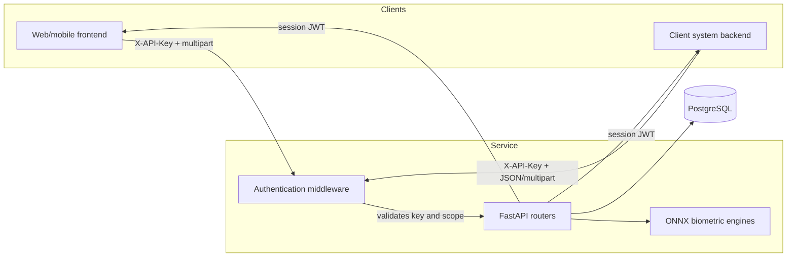

# Biometric Login Service

A biometric authentication microservice built on **FastAPI**. It verifies identity by
**face** (with blink-based liveness detection) and by **voice** (with a random-digit
challenge that defeats replayed recordings), and issues JWT session tokens that other
systems can validate.

It is designed as a central identity component: a single service that several frontends
and several backends connect to through **scoped API keys**.

!!! warning "Status: in development, unofficial pre-release 1.0.0"
    No git release or tag yet; code reaches `main` only once it is stable and functional.
    **Voice** is the most refined module. **Face** is still calibrating its threshold:
    expect false accepts/rejects until it is measured against your own population.
    See [Advertencias de desarrollo](operacion/advertencias.md) (Spanish).

---

## What it solves

| Need | Mechanism |
| --- | --- |
| Verify the face belongs to the account holder | SFace (128 dimensions, cosine similarity) |
| Verify a live person is present | EAR blink detection over facial landmarks (OpenSeeFace) |
| Verify the voice belongs to the account holder | ResNet34 speaker embedding (WeSpeaker/VoxCeleb, 256 dimensions) |
| Prevent replaying an earlier recording | Server-issued random digit challenge, single use |
| Isolate each client system | API keys `lbs_<prefix>_<secret>` with `auth`, `enroll`, `admin` scopes |
| Prevent literal resubmission of a capture | Hash-based replay guard with a time window |
| Slow down brute force | Per-IP and per-user rate limiter |

---

## Architecture

All biometric processing happens **inside the service**. ONNX models are downloaded into
the project tree and no external service is called at runtime.

---

## Two kinds of credential — do not mix them up

The service handles two distinct JWTs and they are not interchangeable:

=== "Portal token"

    - **Scope:** `portal`
    - **Issued by:** `POST /api/portal/auth`
    - **Used for:** administering the service through `/api/*`
    - **Lifetime:** `JWT_EXPIRE_MINUTES` (60 min by default)
    - **Held by:** a human operator

=== "Session token"

    - **Scope:** `user`
    - **Issued by:** a successful login (face, voice or password)
    - **Used for:** telling your application who the person is
    - **Lifetime:** `SESSION_EXPIRE_MINUTES` (15 min by default)
    - **Held by:** the authenticated person

!!! warning "A session token does not open `/api/*`"
    A session token identifies a person; it does not authorise administering the service.
    Client systems call the API with an **API key**, never with an end user's session
    token.

---

## Where to go next

- :material-download: **[Installation](empezar/instalacion.md)**

    Dependencies, ONNX models and database.

- :material-cog: **[Configuration](empezar/configuracion.md)**

    Every environment variable explained.

- :material-api: **[API reference](api/index.md)**

    Authentication, scopes and every endpoint.

- :material-connection: **[Integration](integracion/backend.md)**

    Examples from backend, frontend and session validation.

---

## Project status

!!! danger "Read this before going to production"
    The biometric thresholds in this service are **not calibrated against a real impostor
    population**. They are verified, which is not the same thing. The
    [Known limitations](operacion/limitaciones.md) page records every measurement taken,
    with its numbers and its gaps, and is required reading before any real deployment.
