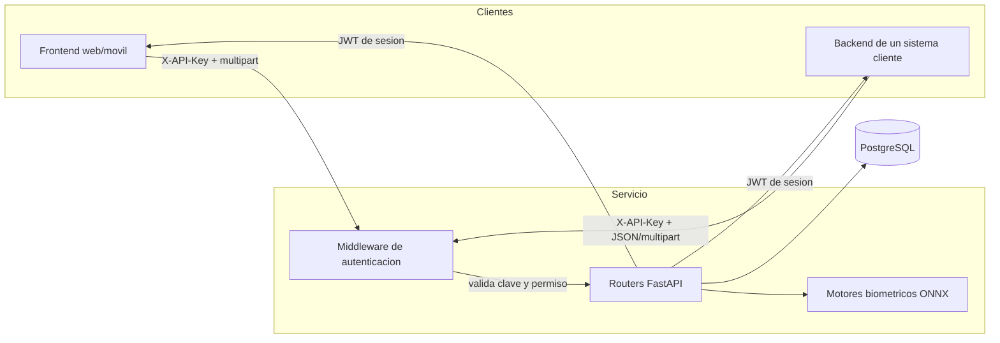

# Login Biometrico Service

Microservicio de autenticacion biometrica construido sobre **FastAPI**. Verifica identidad
por **rostro** (con deteccion de vida por parpadeo) y por **voz** (con desafio de digitos
aleatorios contra reproduccion de grabaciones), y emite tokens JWT de sesion que otros
sistemas pueden validar.

Esta pensado como pieza central de identidad: un unico servicio al que se conectan varios
frontends y varios backends mediante **API keys con permisos**.

!!! warning "Estado: en desarrollo, pre-release 1.0.0 no oficial"
    No hay release ni tag todavia; `main` recibira el codigo solo cuando sea estable y
    funcional. La **voz** es el modulo mas refinado. El **rostro** sigue en calibracion
    de umbral: espera falsos aceptos/rechazos hasta medirlo con tu propia poblacion.
    Ver [Advertencias de desarrollo](operacion/advertencias.md).

---

## Que resuelve

| Necesidad | Mecanismo |
| --- | --- |
| Verificar que la cara es la del titular | SFace (128 dimensiones, similitud coseno) |
| Verificar que hay una persona viva delante | Parpadeo por EAR sobre puntos faciales (OpenSeeFace) |
| Verificar que la voz es la del titular | Embedding de locutor ResNet34 (WeSpeaker/VoxCeleb, 256 dimensiones) |
| Impedir que sirva una grabacion previa | Desafio de digitos aleatorios emitido por el servidor, de un solo uso |
| Aislar a cada sistema cliente | API keys `lbs_<prefijo>_<secreto>` con permisos `auth`, `enroll`, `admin` |
| Impedir reenvio literal de la captura | Guarda de repeticion por hash con ventana temporal |
| Frenar ataques de fuerza bruta | Limitador de intentos por IP y usuario |

---

## Arquitectura

Todo el procesamiento biometrico ocurre **dentro del servicio**. Los modelos ONNX se
descargan al arbol del proyecto y no se llama a ningun servicio externo en tiempo de
ejecucion.

---

## Dos tipos de credencial, no los confundas

El servicio maneja dos JWT distintos y no son intercambiables:

=== "Token de portal"

    - **Scope:** `portal`
    - **Lo emite:** `POST /api/portal/auth`
    - **Sirve para:** administrar el servicio desde el portal (`/api/*`)
    - **Vigencia:** `JWT_EXPIRE_MINUTES` (60 min por defecto)
    - **Quien lo tiene:** un operador humano

=== "Token de sesion"

    - **Scope:** `user`
    - **Lo emite:** un login correcto (rostro, voz o contrasena)
    - **Sirve para:** que tu aplicacion sepa quien es la persona
    - **Vigencia:** `SESSION_EXPIRE_MINUTES` (15 min por defecto)
    - **Quien lo tiene:** la persona autenticada

!!! warning "El token de sesion no abre `/api/*`"
    Un token de sesion identifica a una persona; no autoriza a administrar el servicio.
    Para llamar a la API desde un sistema cliente se usa **API key**, nunca el token de
    sesion del usuario final.

---

## Por donde seguir

- :material-download: **[Instalacion](empezar/instalacion.md)**

    Dependencias, modelos ONNX y base de datos.

- :material-cog: **[Configuracion](empezar/configuracion.md)**

    Todas las variables de entorno explicadas.

- :material-api: **[Referencia de la API](api/index.md)**

    Autenticacion, permisos y todos los endpoints.

- :material-connection: **[Integracion](integracion/backend.md)**

    Ejemplos desde backend, frontend y validacion de sesion. En
    [biometric-integration-test](https://github.com/AIWaveSystems/biometric-integration-test)
    hay ademas un ejemplo completo en Express/Node, generado con IA: tomalo solo como referencia.

---

## Estado del proyecto

!!! danger "Lee esto antes de llevarlo a produccion"
    Los umbrales biometricos de este servicio **no estan calibrados contra una poblacion
    real de impostores**. Estan comprobados, que no es lo mismo. La pagina
    [Limitaciones conocidas](operacion/limitaciones.md) recoge cada medicion hecha, con
    sus numeros y sus huecos, y es lectura obligatoria antes de un despliegue real.
