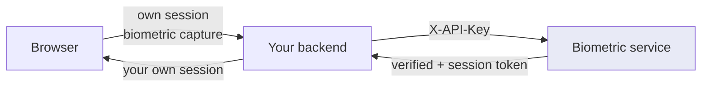
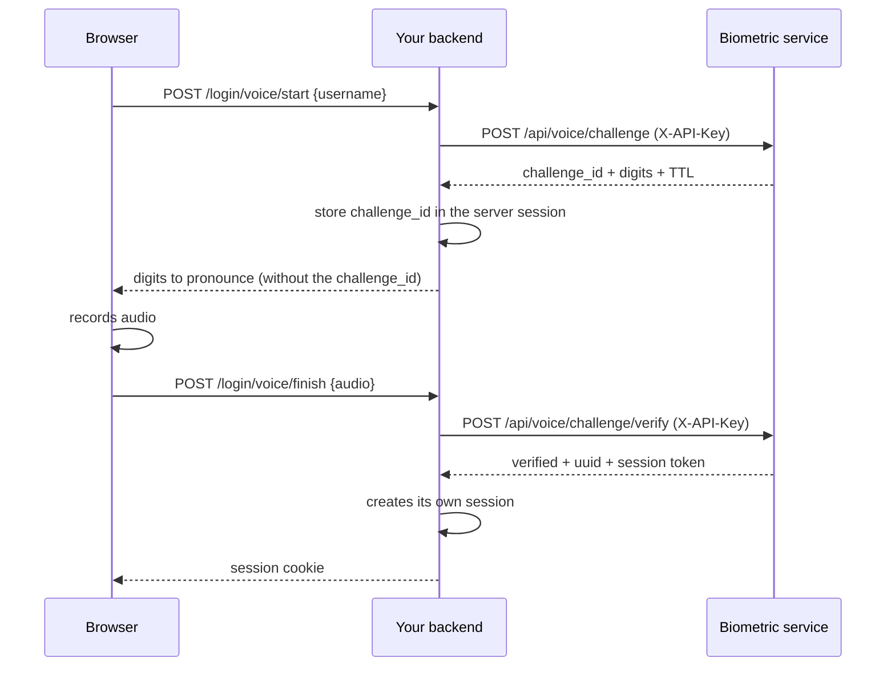

# From a backend

This is the correct way to integrate: the API key lives on your server and never reaches
the browser.

---

## Topology



Your backend acts as the intermediary. The browser captures the image or audio, your
backend forwards it with the API key, and translates the response into your own session
model.

!!! danger "Never put the API key in the frontend"
    Anyone who opens developer tools can read it, and with the `enroll` scope they could
    enrol their own face on somebody else's account. See [From a frontend](frontend.md).

---

## Python

### Reusable client

```python
import httpx
from pathlib import Path


class BiometricClient:
    def __init__(self, base_url: str, api_key: str, timeout: float = 30.0):
        self._http = httpx.Client(
            base_url=base_url.rstrip("/"),
            headers={"X-API-Key": api_key},
            timeout=timeout,
        )

    def register(self, username, photos, audio=None, password=None):
        files = [("images", (p.name, p.read_bytes(), "image/jpeg")) for p in photos]
        if audio is not None:
            files.append(("audio", (audio.name, audio.read_bytes(), "audio/wav")))
        data = {"username": username}
        if password:
            data["password"] = password
        r = self._http.post("/api/users/register", data=data, files=files)
        r.raise_for_status()
        return r.json()

    def face_login(self, username, frames):
        files = [
            ("frames", (f"f{i:02d}.jpg", b, "image/jpeg"))
            for i, b in enumerate(frames)
        ]
        r = self._http.post(
            "/api/face/login", data={"username": username}, files=files
        )
        r.raise_for_status()
        return r.json()

    def request_challenge(self, username):
        r = self._http.post("/api/voice/challenge", data={"username": username})
        r.raise_for_status()
        return r.json()

    def answer_challenge(self, username, challenge_id, audio_bytes):
        r = self._http.post(
            "/api/voice/challenge/verify",
            data={"username": username, "challenge_id": challenge_id},
            files={"audio": ("answer.wav", audio_bytes, "audio/wav")},
        )
        r.raise_for_status()
        return r.json()

    def voice_status(self):
        r = self._http.get("/api/voice/system")
        r.raise_for_status()
        return r.json()
```

### Use from FastAPI

```python
from fastapi import APIRouter, File, Form, HTTPException, UploadFile

router = APIRouter()
bio = BiometricClient("http://biometric.internal:8000", API_KEY)


@router.post("/login/face")
async def face_login(
    username: str = Form(...),
    frames: list[UploadFile] = File(...),
):
    payload = [await f.read() for f in frames]

    try:
        result = bio.face_login(username, payload)
    except httpx.HTTPStatusError as e:
        detail = e.response.json().get("detail", "Verification error")
        if e.response.status_code in (400, 409):
            raise HTTPException(status_code=422, detail=detail)
        if e.response.status_code == 429:
            raise HTTPException(status_code=429, detail=detail)
        raise HTTPException(status_code=502, detail="Biometric service unavailable")

    if not result["verified"]:
        raise HTTPException(status_code=401, detail=result["reason"])

    return {"session": create_my_session(result["uuid"])}
```

!!! tip "Store the UUID, not the name"
    `result["uuid"]` is stable even if the account is renamed. That is the key that should
    travel to your user table.

---

## Node.js

```javascript
const BASE = 'http://biometric.internal:8000';
const API_KEY = process.env.BIOMETRIC_API_KEY;

async function requestChallenge(username) {
  const form = new FormData();
  form.append('username', username);

  const res = await fetch(`${BASE}/api/voice/challenge`, {
    method: 'POST',
    headers: { 'X-API-Key': API_KEY },
    body: form,
  });

  if (!res.ok) {
    const { detail } = await res.json();
    throw new BiometricError(res.status, detail);
  }
  return res.json();
}

async function answerChallenge(username, challengeId, audioBuffer) {
  const form = new FormData();
  form.append('username', username);
  form.append('challenge_id', challengeId);
  form.append('audio', new Blob([audioBuffer], { type: 'audio/wav' }), 'a.wav');

  const res = await fetch(`${BASE}/api/voice/challenge/verify`, {
    method: 'POST',
    headers: { 'X-API-Key': API_KEY },
    body: form,
  });

  if (!res.ok) {
    const { detail } = await res.json();
    throw new BiometricError(res.status, detail);
  }
  return res.json();
}
```

!!! warning "Do not set Content-Type by hand"
    With `FormData`, `fetch` computes the multipart `boundary` itself. If you set
    `Content-Type: multipart/form-data` manually, the boundary is lost and the server
    responds 422.

---

## Full voice login flow



!!! tip "The `challenge_id` stays on your server"
    Keep it in the server-side session and do not send it to the browser. That way the
    client cannot try to answer challenges that are not theirs.

---

## Errors and retries

```python
RETRY_CAPTURE = 400
CONFLICT = 409
RATE_LIMIT = 429

RETRYABLE_PHRASES = ("Captura repetida", "Grabacion repetida")


def classify(status: int, detail: str) -> str:
    if status == RETRY_CAPTURE:
        return "retry"
    if status == RATE_LIMIT:
        return "wait"
    if status == CONFLICT:
        if any(f in detail for f in RETRYABLE_PHRASES):
            return "retry"
        if "Desafio" in detail:
            return "new-challenge"
        return "conflict"
    return "error"
```

| Class | What to do |
| --- | --- |
| `retry` | Ask for another capture and retry, up to 3 times |
| `wait` | Wait for the full window (60 s by default) |
| `new-challenge` | Go back to `POST /api/voice/challenge` |
| `conflict` | Human intervention |
| `error` | Log and alert |

!!! warning "Never auto-retry a 401 or 403"
    Those are credential problems, not network problems. Retrying only burns quota and
    fills the logs. Check the API key and its scopes.

---

## Operational recommendations

| Aspect | Recommendation |
| --- | --- |
| Timeout | 30 s for face login (several images), 15 s for voice |
| Connections | Reuse a single HTTP client: `httpx.Client` or a keep-alive agent |
| Burst size | 20 to 30 JPEG frames at quality 0.9. More does not improve accuracy |
| Network | Keep the service on an internal network, not exposed to the internet |
| Logging | **Do not** store images or audio. Log `uuid`, `verified`, `similarity` and `scoring` |
| Monitoring | Poll `GET /health`, and `GET /api/voice/system` after each deployment |

!!! danger "Biometric data and Colombia's Law 1581"
    In Colombia, biometric data is **sensitive data**. You need prior, express and informed
    consent, and a declared purpose. This service stores mathematical templates rather than
    images or audio, but that does not remove the consent requirement. See
    [Security and thresholds](../operacion/seguridad.md).
