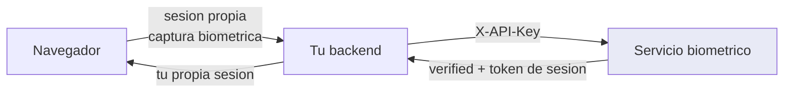
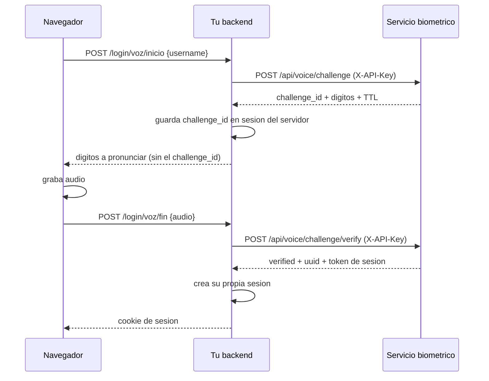

# Desde un backend

Es la forma correcta de integrar: la API key vive en tu servidor y nunca llega al
navegador.

---

## Topologia



Tu backend hace de intermediario. El navegador captura la imagen o el audio, tu backend la
reenvia con la API key, y traduce la respuesta a tu propio modelo de sesion.

!!! danger "Nunca pongas la API key en el frontend"
    Cualquiera que abra las herramientas de desarrollo la lee, y con permiso `enroll`
    podria matricular su propia cara en la cuenta de otro. Ver
    [Desde un frontend](frontend.md).

!!! info "Proyecto de ejemplo de integracion"
    En [AIWaveSystems/biometric-integration-test](https://github.com/AIWaveSystems/biometric-integration-test)
    hay un servidor Express/Node que muestra **una** manera de hacer esta integracion
    de extremo a extremo. No es la unica ni codigo de produccion: fue generado con IA.
    Tomalo solo como referencia para comparar con tu propia implementacion.

---

## Python

### Cliente reutilizable

```python
import httpx
from pathlib import Path


class BiometricoClient:
    def __init__(self, base_url: str, api_key: str, timeout: float = 30.0):
        self._http = httpx.Client(
            base_url=base_url.rstrip("/"),
            headers={"X-API-Key": api_key},
            timeout=timeout,
        )

    def registrar(self, username, fotos, audio=None, password=None):
        files = [("images", (p.name, p.read_bytes(), "image/jpeg")) for p in fotos]
        if audio is not None:
            files.append(("audio", (audio.name, audio.read_bytes(), "audio/wav")))
        data = {"username": username}
        if password:
            data["password"] = password
        r = self._http.post("/api/users/register", data=data, files=files)
        r.raise_for_status()
        return r.json()

    def login_rostro(self, username, frames):
        files = [
            ("frames", (f"f{i:02d}.jpg", b, "image/jpeg"))
            for i, b in enumerate(frames)
        ]
        r = self._http.post(
            "/api/face/login", data={"username": username}, files=files
        )
        r.raise_for_status()
        return r.json()

    def pedir_desafio(self, username):
        r = self._http.post("/api/voice/challenge", data={"username": username})
        r.raise_for_status()
        return r.json()

    def responder_desafio(self, username, challenge_id, audio_bytes):
        r = self._http.post(
            "/api/voice/challenge/verify",
            data={"username": username, "challenge_id": challenge_id},
            files={"audio": ("respuesta.wav", audio_bytes, "audio/wav")},
        )
        r.raise_for_status()
        return r.json()

    def estado_voz(self):
        r = self._http.get("/api/voice/system")
        r.raise_for_status()
        return r.json()
```

### Uso desde FastAPI

```python
from fastapi import APIRouter, File, Form, HTTPException, UploadFile

router = APIRouter()
bio = BiometricoClient("http://biometrico.interno:8000", API_KEY)


@router.post("/login/rostro")
async def login_rostro(
    username: str = Form(...),
    frames: list[UploadFile] = File(...),
):
    payload = [await f.read() for f in frames]

    try:
        resultado = bio.login_rostro(username, payload)
    except httpx.HTTPStatusError as e:
        detalle = e.response.json().get("detail", "Error de verificacion")
        if e.response.status_code in (400, 409):
            raise HTTPException(status_code=422, detail=detalle)
        if e.response.status_code == 429:
            raise HTTPException(status_code=429, detail=detalle)
        raise HTTPException(status_code=502, detail="Servicio biometrico no disponible")

    if not resultado["verified"]:
        raise HTTPException(status_code=401, detail=resultado["reason"])

    return {"sesion": crear_mi_sesion(resultado["uuid"])}
```

!!! tip "Guarda el UUID, no el nombre"
    `resultado["uuid"]` es estable aunque renombren la cuenta. Es la clave que debe viajar
    a tu tabla de usuarios.

---

## Node.js

```javascript
const BASE = 'http://biometrico.interno:8000';
const API_KEY = process.env.BIOMETRIC_API_KEY;

async function pedirDesafio(username) {
  const form = new FormData();
  form.append('username', username);

  const res = await fetch(`${BASE}/api/voice/challenge`, {
    method: 'POST',
    headers: { 'X-API-Key': API_KEY },
    body: form,
  });

  if (!res.ok) {
    const { detail } = await res.json();
    throw new BiometricError(res.status, detail);
  }
  return res.json();
}

async function responderDesafio(username, challengeId, audioBuffer) {
  const form = new FormData();
  form.append('username', username);
  form.append('challenge_id', challengeId);
  form.append('audio', new Blob([audioBuffer], { type: 'audio/wav' }), 'r.wav');

  const res = await fetch(`${BASE}/api/voice/challenge/verify`, {
    method: 'POST',
    headers: { 'X-API-Key': API_KEY },
    body: form,
  });

  if (!res.ok) {
    const { detail } = await res.json();
    throw new BiometricError(res.status, detail);
  }
  return res.json();
}
```

!!! warning "No pongas Content-Type a mano"
    Con `FormData`, el `fetch` calcula el `boundary` del multipart por su cuenta. Si fijas
    `Content-Type: multipart/form-data` manualmente, el boundary se pierde y el servidor
    responde 422.

---

## Ciclo de vida del usuario por UUID

Cuando das de alta a alguien (`POST /api/users/register` o `POST /api/face/register`),
la respuesta trae el `uuid` del usuario. **Guardalo en tu propia base**, asociado a tu
usuario local: es la clave con la que consultaras, actualizaras y eliminaras sus datos
biometricos mas adelante. Sobrevive a los renombrados y nunca cambia.

| Operacion en el servicio | Endpoint | Permiso |
| --- | --- | --- |
| Consultar estado y plantillas | `GET /api/users/by-uuid/{uuid}` | `auth` |
| Anadir plantillas faciales | `POST /api/users/by-uuid/{uuid}/faces` | `enroll` |
| Fijar, cambiar o retirar contrasena | `POST /api/users/by-uuid/{uuid}/password` | `admin` |
| Renombrar conservando el `uuid` | `POST /api/users/by-uuid/{uuid}/rename` | `admin` |
| Dar de baja (borra plantillas) | `DELETE /api/users/by-uuid/{uuid}` | `admin` |

```python
def detalle(self, user_uuid):
    r = self._http.get(f"/api/users/by-uuid/{user_uuid}")
    r.raise_for_status()
    return r.json()

def anadir_rostros(self, user_uuid, fotos):
    files = [("images", (p.name, p.read_bytes(), "image/jpeg")) for p in fotos]
    r = self._http.post(f"/api/users/by-uuid/{user_uuid}/faces", files=files)
    r.raise_for_status()
    return r.json()

def dar_de_baja(self, user_uuid):
    r = self._http.delete(f"/api/users/by-uuid/{user_uuid}")
    r.raise_for_status()
    return r.json()
```

!!! tip "Borra en el servicio cuando borres en tu sistema"
    Si el usuario se da de baja en tu plataforma, propaga el `DELETE` al servicio en el
    mismo proceso. Sus plantillas biometricas no deben sobrevivir a su cuenta.

!!! warning "Tu API key solo ve a tus propios usuarios"
    Todo lo que registres con tu key queda ligado a ella: las consultas, actualizaciones
    y borrados solo alcanzan a usuarios creados por tu sistema. Los usuarios anteriores o
    dados de alta desde el portal solo son visibles para el portal o keys `admin`. Ver
    [Modelo de seguridad](../operacion/seguridad.md).

---

## Flujo completo de login por voz



!!! tip "El `challenge_id` se queda en tu servidor"
    Guardalo en la sesion del lado servidor y no lo mandes al navegador. Asi el cliente no
    puede intentar responder desafios que no le corresponden.

---

## Errores y reintentos

```python
REPETIR_CAPTURA = 400
CONFLICTO = 409
LIMITE = 429

FRASES_REPETIBLES = ("Captura repetida", "Grabacion repetida")


def clasificar(status: int, detalle: str) -> str:
    if status == REPETIR_CAPTURA:
        return "repetir"
    if status == LIMITE:
        return "esperar"
    if status == CONFLICTO:
        if any(f in detalle for f in FRASES_REPETIBLES):
            return "repetir"
        if "Desafio" in detalle:
            return "desafio-nuevo"
        return "conflicto"
    return "error"
```

| Clase | Que hacer |
| --- | --- |
| `repetir` | Pedir otra captura y reintentar, hasta 3 veces |
| `esperar` | Esperar la ventana completa (60 s por defecto) |
| `desafio-nuevo` | Volver a `POST /api/voice/challenge` |
| `conflicto` | Intervencion humana |
| `error` | Registrar y avisar |

!!! warning "No reintentes automaticamente un 401 o un 403"
    Son problemas de credencial, no de red. Reintentar solo consume cuota y llena los
    registros. Revisa la API key y sus permisos.

---

## Recomendaciones operativas

| Aspecto | Recomendacion |
| --- | --- |
| Tiempo de espera | 30 s para login facial (varias imagenes), 15 s para voz |
| Conexiones | Reutiliza un unico cliente HTTP: `httpx.Client` o un agente con keep-alive |
| Tamano de rafaga | 30 a 40 frames JPEG de calidad 0.9, ventana de ~3 s con el aviso de parpadeo visible antes y durante la captura. Mas frames no mejora la identidad |
| Red | El servicio en red interna, no expuesto a internet |
| Registros | **No** guardes las imagenes ni el audio. Registra `uuid`, `verified`, `similarity` y `scoring` |
| Vigilancia | Sondea `GET /health`, y `GET /api/voice/system` tras cada despliegue |

!!! danger "Datos biometricos y Ley 1581"
    En Colombia los datos biometricos son **datos sensibles**. Necesitas consentimiento
    previo, expreso e informado, y una finalidad declarada. Este servicio guarda plantillas
    matematicas, no imagenes ni audio, pero eso no exime del consentimiento. Ver
    [Seguridad y umbrales](../operacion/seguridad.md).
