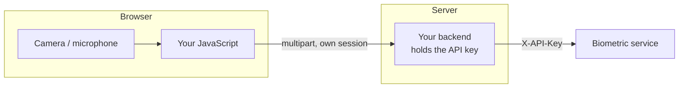

# From a frontend

The browser's job is to **capture**, never to authenticate. It sends what it captured to
your backend, and your backend talks to the biometric service.

!!! danger "A rule with no exceptions"
    The API key **never** reaches the browser. Not in a bundler environment variable, not in
    `localStorage`, not in a request. Everything that reaches the browser is public.



---

## Capture the face burst

Face login needs to see a blink. You must record a sequence, not a photo.

```javascript
async function captureBurst(video, nFrames = 28, intervalMs = 90) {
  const canvas = document.createElement('canvas');
  canvas.width = video.videoWidth;
  canvas.height = video.videoHeight;
  const ctx = canvas.getContext('2d');

  const frames = [];
  for (let i = 0; i < nFrames; i++) {
    ctx.drawImage(video, 0, 0, canvas.width, canvas.height);
    const blob = await new Promise((r) =>
      canvas.toBlob(r, 'image/jpeg', 0.9)
    );
    frames.push(blob);
    await new Promise((r) => setTimeout(r, intervalMs));
  }
  return frames;
}
```

28 frames every 90 ms is about 2.6 seconds, plenty of time for a natural blink.

### Request the camera

```javascript
const stream = await navigator.mediaDevices.getUserMedia({
  video: {
    width: { ideal: 640 },
    height: { ideal: 480 },
    facingMode: 'user',
  },
});
video.srcObject = stream;
await video.play();
```

### Prompt for the blink

Without a visible instruction, most people do not blink during the capture and the login
fails with `blink_detected: false`.

```javascript
async function faceLogin(video, username, banner) {
  banner.textContent = 'Look at the camera...';
  await new Promise((r) => setTimeout(r, 600));

  const capture = captureBurst(video);

  setTimeout(() => { banner.textContent = 'BLINK NOW'; }, 900);

  const frames = await capture;
  banner.textContent = 'Verifying...';

  const form = new FormData();
  form.append('username', username);
  frames.forEach((b, i) => form.append('frames', b, `f${i}.jpg`));

  const res = await fetch('/my-backend/login/face', {
    method: 'POST',
    body: form,
    credentials: 'include',
  });
  return res.json();
}
```

!!! tip "The mid-capture prompt"
    Firing the banner at 900 ms leaves eyes-open frames both before and after the blink,
    which is exactly what the EAR detector needs to measure the transition.

---

## Capture audio

```javascript
async function captureAudio(seconds = 6) {
  const stream = await navigator.mediaDevices.getUserMedia({
    audio: {
      echoCancellation: false,
      noiseSuppression: false,
      autoGainControl: false,
      channelCount: 1,
    },
  });

  const rec = new MediaRecorder(stream);
  const chunks = [];
  rec.ondataavailable = (e) => chunks.push(e.data);
  rec.start();

  await new Promise((r) => setTimeout(r, seconds * 1000));
  rec.stop();
  await new Promise((r) => (rec.onstop = r));
  stream.getTracks().forEach((t) => t.stop());

  return new Blob(chunks, { type: rec.mimeType });
}
```

!!! danger "Those three audio options are not optional"
    Chrome enables echo cancellation, noise suppression and automatic gain control by
    default. All three alter timbre enough to degrade the speaker embedding, and cause
    rejections of legitimate users that have no other explanation. Always set them to
    `false`.

### Check the level before sending

The service rejects audio below -55 dBFS, but it is better to catch it in the browser and
ask for a retake.

```javascript
async function peakLevel(blob) {
  const ctx = new AudioContext();
  const buf = await ctx.decodeAudioData(await blob.arrayBuffer());
  const data = buf.getChannelData(0);
  let peak = 0;
  for (let i = 0; i < data.length; i++) {
    const v = Math.abs(data[i]);
    if (v > peak) peak = v;
  }
  await ctx.close();
  return peak;
}

const peak = await peakLevel(audio);
if (peak < 0.02) {
  show('We could not hear anything. Move closer to the microphone and try again.');
  return null;
}
```

!!! warning "Discard the failed recording"
    If a capture fails the level check, set the variable holding it to `null`. A classic bug
    is reusing the previous recording because the new one failed and nobody cleared the
    state.

---

## Voice login with a challenge

```javascript
async function voiceLogin(username, banner) {
  const start = await fetch('/my-backend/login/voice/start', {
    method: 'POST',
    headers: { 'Content-Type': 'application/json' },
    body: JSON.stringify({ username }),
    credentials: 'include',
  }).then((r) => r.json());

  banner.textContent = `Say out loud: ${start.digits.join('  -  ')}`;

  await new Promise((r) => setTimeout(r, 1500));
  const audio = await captureAudio(start.digits.length * 1.5 + 3);

  const form = new FormData();
  form.append('audio', audio, 'answer.wav');

  const res = await fetch('/my-backend/login/voice/finish', {
    method: 'POST',
    body: form,
    credentials: 'include',
  });
  return res.json();
}
```

The `challenge_id` stays in the server session. The browser only sees the digits.

!!! warning "Every retry needs a fresh challenge"
    A challenge is consumed on use, whether it succeeds or fails. Retrying with the same one
    returns 409 forever. Your retry flow goes back to the start step.

---

## Messages for the user

The response carries `reason` in Spanish, already phrased for display. Even so, it is worth
distinguishing two situations:

```javascript
function message(result, status) {
  if (result.verified) return null;

  if (status === 400 || status === 409) {
    return { text: result.detail, kind: 'retry' };
  }

  if (result.blink_detected === false) {
    return { text: 'We did not see you blink. Try again and blink.', kind: 'retry' };
  }

  if (result.identity_ok === false) {
    return { text: 'We could not recognise you.', kind: 'denied' };
  }
  if (result.content_ok === false) {
    return { text: 'The digits do not match. Try again more slowly.', kind: 'retry' };
  }

  return { text: result.reason ?? 'We could not verify you.', kind: 'denied' };
}
```

| Kind | Interface |
| --- | --- |
| `retry` | Orange notice with a *Try again* button. Does not count as a failure |
| `denied` | Red notice. Offer another authentication method |

!!! tip "Do not say 'access denied' for a camera problem"
    Confusing a capture failure with an identity rejection is the biggest source of
    frustration in biometrics. `blink_detected: false` means *try again*, not *you are not
    who you say*.

---

## Accessibility and consent

| Requirement | How to meet it |
| --- | --- |
| Explicit consent | A checkbox before the first capture, stating purpose and retention |
| Non-biometric alternative | A password or second factor always available |
| Photosensitivity | Do not use flashes to trigger the blink |
| Screen readers | Announce instructions with `aria-live="assertive"` |
| Permission denied | Explain what to do, not just *camera error* |

```javascript
try {
  stream = await navigator.mediaDevices.getUserMedia({ video: true });
} catch (e) {
  if (e.name === 'NotAllowedError') {
    show('Camera access was denied. Enable it from the padlock in the address bar.');
  } else if (e.name === 'NotFoundError') {
    show('We could not find any connected camera.');
  } else {
    show('We could not open the camera. Use your password instead.');
  }
}
```

!!! danger "It only works over HTTPS"
    `getUserMedia` requires a secure context. HTTPS is mandatory in production. In
    development, `localhost` counts as secure; a local network IP does not.

---

## Before going to production

- [ ] The API key does **not** appear in any bundle file
- [ ] `echoCancellation`, `noiseSuppression` and `autoGainControl` are `false`
- [ ] The blink prompt appears mid-capture
- [ ] Failed recordings are discarded, not reused
- [ ] Every voice retry requests a fresh challenge
- [ ] Capture errors are distinguished from identity rejections
- [ ] Stream tracks are stopped when finished (the camera light goes off)
- [ ] A non-biometric alternative exists
- [ ] Everything is served over HTTPS
