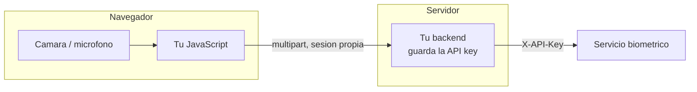

# Desde un frontend

El navegador se encarga de **capturar**, nunca de autenticar. Manda lo capturado a tu
backend, y es tu backend quien habla con el servicio biometrico.

!!! danger "Regla que no admite excepciones"
    La API key **jamas** llega al navegador. Ni en una variable de entorno del bundler, ni
    en `localStorage`, ni en una peticion. Todo lo que llega al navegador es publico.



---

## Capturar la rafaga facial

El login facial necesita ver un parpadeo. Hay que grabar una secuencia, no una foto.

```javascript
async function capturarRafaga(video, nFrames = 34, intervaloMs = 90) {
  const canvas = document.createElement('canvas');
  canvas.width = video.videoWidth;
  canvas.height = video.videoHeight;
  const ctx = canvas.getContext('2d');

  const frames = [];
  for (let i = 0; i < nFrames; i++) {
    ctx.drawImage(video, 0, 0, canvas.width, canvas.height);
    const blob = await new Promise((r) =>
      canvas.toBlob(r, 'image/jpeg', 0.9)
    );
    frames.push(blob);
    await new Promise((r) => setTimeout(r, intervaloMs));
  }
  return frames;
}
```

34 frames cada 90 ms son unos 3 segundos: una ventana amplia para que quepa un
parpadeo natural aunque la persona tarde en reaccionar al aviso. Mas frames no
mejoran la precision de identidad (los duplicados se colapsan en el servidor),
solo dan margen al parpadeo.

### Pedir la camara

```javascript
const stream = await navigator.mediaDevices.getUserMedia({
  video: {
    width: { ideal: 640 },
    height: { ideal: 480 },
    facingMode: 'user',
  },
});
video.srcObject = stream;
await video.play();
```

### Avisar del parpadeo

Sin instruccion visible, la mayoria de la gente no parpadea durante la captura y el login
falla por `blink_detected: false`. El aviso debe existir **antes** de empezar a capturar:
la gente tarda en reaccionar, y un cartel que aparece a mitad de rafaga llega tarde.

```javascript
async function loginFacial(video, username, cartel) {
  cartel.textContent = 'Mira a la camara y PARPADEA cuando veas el aviso';
  await new Promise((r) => setTimeout(r, 800));

  const captura = capturarRafaga(video);

  setTimeout(() => { cartel.textContent = 'PARPADEA AHORA'; }, 900);

  const frames = await captura;
  cartel.textContent = 'Verificando...';

  const form = new FormData();
  form.append('username', username);
  frames.forEach((b, i) => form.append('frames', b, `f${i}.jpg`));

  const res = await fetch('/mi-backend/login/rostro', {
    method: 'POST',
    body: form,
    credentials: 'include',
  });
  return res.json();
}
```

!!! tip "Aviso antes y durante la captura"
    La instruccion previa prepara a la persona; el cartel a los 900 ms dispara el
    parpadeo dejando frames de ojos abiertos antes y despues, que es justo lo que el
    detector de EAR necesita para medir la transicion.

---

## Capturar audio

```javascript
async function capturarAudio(segundos = 6) {
  const stream = await navigator.mediaDevices.getUserMedia({
    audio: {
      echoCancellation: false,
      noiseSuppression: false,
      autoGainControl: false,
      channelCount: 1,
    },
  });

  const rec = new MediaRecorder(stream);
  const trozos = [];
  rec.ondataavailable = (e) => trozos.push(e.data);
  rec.start();

  await new Promise((r) => setTimeout(r, segundos * 1000));
  rec.stop();
  await new Promise((r) => (rec.onstop = r));
  stream.getTracks().forEach((t) => t.stop());

  return new Blob(trozos, { type: rec.mimeType });
}
```

!!! danger "Las tres opciones de audio no son opcionales"
    Chrome activa por defecto cancelacion de eco, supresion de ruido y control automatico
    de ganancia. Las tres alteran el timbre lo suficiente como para degradar el embedding
    de locutor, y provocan rechazos de usuarios legitimos que no se explican de otra forma.
    Ponlas en `false` siempre.

### Comprobar el nivel antes de enviar

El servicio rechaza audio por debajo de -55 dBFS, pero es mejor detectarlo en el navegador
y pedir que repita.

```javascript
async function nivelPico(blob) {
  const ctx = new AudioContext();
  const buf = await ctx.decodeAudioData(await blob.arrayBuffer());
  const datos = buf.getChannelData(0);
  let pico = 0;
  for (let i = 0; i < datos.length; i++) {
    const v = Math.abs(datos[i]);
    if (v > pico) pico = v;
  }
  await ctx.close();
  return pico;
}

const pico = await nivelPico(audio);
if (pico < 0.02) {
  mostrar('No se escucho nada. Acercate al microfono y repite.');
  return null;
}
```

!!! warning "Descarta la grabacion fallida"
    Si una captura no pasa el control de nivel, pon a `null` la variable donde la guardas.
    Un bug clasico es reutilizar la grabacion anterior porque la nueva fallo y nadie limpio
    el estado.

---

## Login por voz con desafio

```javascript
async function loginPorVoz(username, cartel) {
  const inicio = await fetch('/mi-backend/login/voz/inicio', {
    method: 'POST',
    headers: { 'Content-Type': 'application/json' },
    body: JSON.stringify({ username }),
    credentials: 'include',
  }).then((r) => r.json());

  cartel.textContent = `Di en voz alta: ${inicio.digits.join('  -  ')}`;

  await new Promise((r) => setTimeout(r, 1500));
  const audio = await capturarAudio(inicio.digits.length * 1.5 + 3);

  const form = new FormData();
  form.append('audio', audio, 'respuesta.wav');

  const res = await fetch('/mi-backend/login/voz/fin', {
    method: 'POST',
    body: form,
    credentials: 'include',
  });
  return res.json();
}
```

El `challenge_id` se queda en la sesion del servidor. El navegador solo ve los digitos.

!!! warning "Cada reintento necesita un desafio nuevo"
    Un desafio se consume al usarlo, acierte o falle. Reintentar con el mismo devuelve 409
    para siempre. Tu flujo de reintento vuelve al paso de inicio.

---

## Mensajes para el usuario

La respuesta trae `reason` en espanol, ya redactado para mostrarse. Aun asi conviene
distinguir dos situaciones:

```javascript
function mensaje(resultado, status) {
  if (resultado.verified) return null;

  if (status === 400 || status === 409) {
    return { texto: resultado.detail, tipo: 'repetir' };
  }

  if (resultado.blink_detected === false) {
    return { texto: 'No te vimos parpadear. Repite y parpadea.', tipo: 'repetir' };
  }

  if (resultado.identity_ok === false) {
    return { texto: 'No pudimos reconocerte.', tipo: 'denegado' };
  }
  if (resultado.content_ok === false) {
    return { texto: 'Los digitos no coinciden. Repite mas despacio.', tipo: 'repetir' };
  }

  return { texto: resultado.reason ?? 'No pudimos verificarte.', tipo: 'denegado' };
}
```

| Tipo | Interfaz |
| --- | --- |
| `repetir` | Aviso naranja con boton *Reintentar*. No cuenta como fallo |
| `denegado` | Aviso rojo. Ofrece otro metodo de autenticacion |

!!! tip "No digas 'acceso denegado' por un problema de camara"
    Confundir un fallo de captura con un rechazo de identidad es la mayor fuente de
    frustracion en biometria. `blink_detected: false` significa *repite*, no *no eres tu*.

---

## Accesibilidad y consentimiento

| Requisito | Como resolverlo |
| --- | --- |
| Consentimiento explicito | Casilla previa a la primera captura, con finalidad y plazo |
| Alternativa sin biometria | Contrasena o segundo factor siempre disponible |
| Fotosensibilidad | No uses destellos para provocar el parpadeo |
| Lector de pantalla | Anuncia las instrucciones con `aria-live="assertive"` |
| Permiso denegado | Explica que hacer, no solo *error de camara* |

```javascript
try {
  stream = await navigator.mediaDevices.getUserMedia({ video: true });
} catch (e) {
  if (e.name === 'NotAllowedError') {
    mostrar('Diste permiso denegado a la camara. Actívalo en el candado de la barra de direcciones.');
  } else if (e.name === 'NotFoundError') {
    mostrar('No encontramos ninguna camara conectada.');
  } else {
    mostrar('No pudimos abrir la camara. Usa tu contrasena.');
  }
}
```

!!! danger "Solo funciona en HTTPS"
    `getUserMedia` exige un contexto seguro. En produccion, HTTPS obligatorio. En
    desarrollo, `localhost` cuenta como seguro; una IP de red local, no.

---

## Antes de salir a produccion

- [ ] La API key **no** aparece en ningun archivo del bundle
- [ ] `echoCancellation`, `noiseSuppression` y `autoGainControl` en `false`
- [ ] El aviso de parpadeo se muestra a mitad de la captura
- [ ] La grabacion fallida se descarta, no se reutiliza
- [ ] Cada reintento de voz pide desafio nuevo
- [ ] Los errores de captura se distinguen de los rechazos de identidad
- [ ] Los tracks del `stream` se paran al terminar (el piloto de la camara se apaga)
- [ ] Hay una alternativa sin biometria
- [ ] Se sirve por HTTPS
