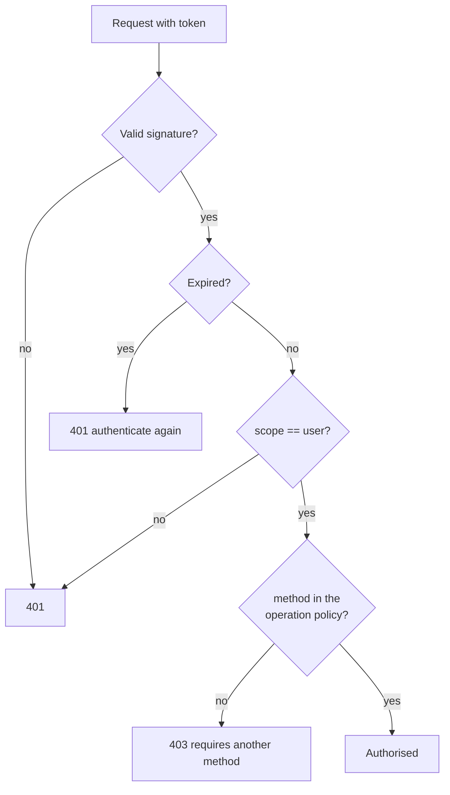

# Validating the session

When a login succeeds, the service returns an `access_token`. It is a JWT signed with
`JWT_SECRET` that your system can validate without calling the service again.

---

## Token contents

```json
{
  "sub": "ana",
  "uid": "8c1e4f2a-...",
  "scope": "user",
  "method": "voice-challenge",
  "iat": 1755299100,
  "exp": 1755300000
}
```

| Claim | Contents |
| --- | --- |
| `sub` | Username **at the moment of login** |
| `uid` | Stable account UUID |
| `scope` | Always `"user"` for sessions |
| `method` | How they authenticated |
| `iat` | Issued at, UTC |
| `exp` | Expiry, UTC |

### `method` values

| Value | Source | Strength |
| --- | --- | --- |
| `voice-challenge` | `POST /api/voice/challenge/verify` | **Highest.** Voice plus unpredictable content |
| `face` | `POST /api/face/login` | High. Face plus blink |
| `voice` | `POST /api/voice/verify` | Medium. Vulnerable to loudspeaker playback |
| `password` | `POST /api/auth/login` | Basic. No biometrics |

!!! tip "Require the method, not just the session"
    For sensitive operations, check `method`. A session opened with `password` should not
    authorise a transfer if your policy requires biometrics.

---

## Validate in Python

```python
import jwt

STRONG_METHODS = {"face", "voice-challenge"}


def validate_session(token: str, allowed_methods: set[str] | None = None) -> dict:
    try:
        payload = jwt.decode(
            token,
            JWT_SECRET,
            algorithms=["HS256"],
            options={"require": ["exp", "sub", "scope"]},
        )
    except jwt.ExpiredSignatureError:
        raise SessionExpired("The session expired, authenticate again")
    except jwt.PyJWTError:
        raise SessionInvalid("Invalid token")

    if payload.get("scope") != "user":
        raise SessionInvalid("The token is not a user session token")

    allowed = allowed_methods or STRONG_METHODS
    if payload.get("method") not in allowed:
        raise MethodTooWeak(
            f"This operation requires one of {sorted(allowed)}"
        )

    return payload
```

!!! danger "Pin the algorithm"
    Always passing `algorithms=["HS256"]` is what blocks the `alg: none` attack and
    algorithm confusion. Never read the algorithm from the token's own header.

### FastAPI dependency

```python
from fastapi import Depends, Header, HTTPException


def current_session(authorization: str = Header(...)) -> dict:
    if not authorization.startswith("Bearer "):
        raise HTTPException(status_code=401, detail="Missing token")
    try:
        return validate_session(authorization[7:])
    except SessionExpired as e:
        raise HTTPException(status_code=401, detail=str(e))
    except MethodTooWeak as e:
        raise HTTPException(status_code=403, detail=str(e))


@app.get("/profile")
def profile(session: dict = Depends(current_session)):
    return {"uuid": session["uid"], "method": session["method"]}
```

---

## Validate in Node.js

```javascript
import jwt from 'jsonwebtoken';

const STRONG = new Set(['face', 'voice-challenge']);

export function validateSession(token, allowed = STRONG) {
  let payload;
  try {
    payload = jwt.verify(token, process.env.JWT_SECRET, {
      algorithms: ['HS256'],
    });
  } catch (e) {
    if (e.name === 'TokenExpiredError') throw new SessionExpired();
    throw new SessionInvalid();
  }

  if (payload.scope !== 'user') throw new SessionInvalid();
  if (!allowed.has(payload.method)) throw new MethodTooWeak();

  return payload;
}
```

---

## Per-operation policies

```python
POLICIES = {
    "view_profile":  {"password", "face", "voice", "voice-challenge"},
    "edit_profile":  {"face", "voice-challenge"},
    "sign_contract": {"voice-challenge"},
    "transfer":      {"face", "voice-challenge"},
}


def require(operation: str):
    def dependency(authorization: str = Header(...)):
        return validate_session(authorization[7:], POLICIES[operation])
    return Depends(dependency)


@app.post("/contracts/{id}/sign")
def sign(id: int, session=require("sign_contract")):
    ...
```



---

## Lifetime and renewal

Session tokens last `SESSION_EXPIRE_MINUTES`, **15 minutes** by default.

**There is no refresh token, and that is deliberate.** Renewing a biometric session without
rechecking the biometrics defeats its purpose. When it expires, the login is repeated.

If 15 minutes is too short for your case, the correct pattern is:

1. Validate the biometric token **once**, at entry
2. Create your **own** session with your duration and your rules
3. Store `uid` and `method` in that session
4. Re-request biometrics only for sensitive operations

```python
@app.post("/login/biometric")
def login(biometric_token: str, response: Response):
    payload = validate_session(biometric_token)

    session_id = create_session(
        uuid=payload["uid"],
        method=payload["method"],
        verified_at=datetime.utcnow(),
        duration=timedelta(hours=8),
    )
    response.set_cookie(
        "session", session_id,
        httponly=True, secure=True, samesite="strict",
    )
    return {"ok": True}
```

!!! warning "Re-verify by age"
    Store `verified_at` and require fresh biometrics if more than N minutes have passed,
    even if your session is still alive. That is what separates *you are logged in* from
    *you just proved it is you*.

---

## Common mistakes

!!! danger "Sending the session token to the biometric service"
    ```python
    # WRONG: returns 401
    httpx.get(f"{BASE}/api/users", headers={"Authorization": f"Bearer {session_token}"})

    # RIGHT
    httpx.get(f"{BASE}/api/users", headers={"X-API-Key": API_KEY})
    ```
    The middleware only accepts `scope: "portal"` in `Authorization`.

!!! danger "Storing `sub` instead of `uid`"
    `sub` is the username and changes if the account is renamed. `uid` is the UUID and never
    changes. Always reference by `uid`.

!!! danger "Trusting the token without verifying the signature"
    Decoding the JWT without verification (`jwt.decode(..., options={"verify_signature":
    False})`) turns your authentication into a form anyone can fill in. The signature is the
    only reason the token is worth anything.

!!! warning "Sharing `JWT_SECRET` without control"
    Anyone holding the secret can **forge** valid session tokens. If you have several client
    systems, consider asymmetric signing (RS256) and distributing only the public key. With
    HS256 the secret must live only in the service and in maximally trusted backends.
