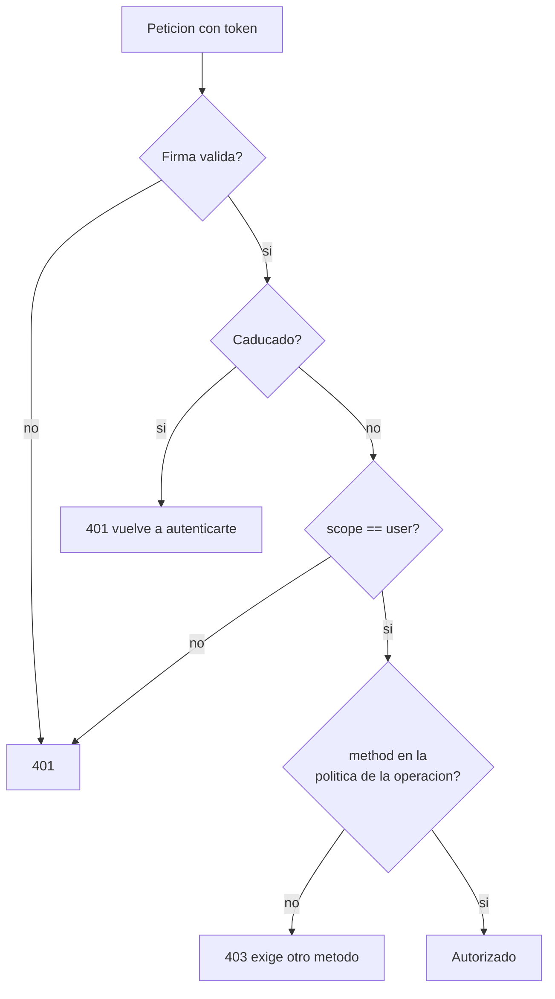

# Validar la sesion

Cuando un login sale bien, el servicio devuelve un `access_token`. Es un JWT firmado con
`JWT_SECRET` que tu sistema puede validar sin volver a llamar al servicio.

---

## Contenido del token

```json
{
  "sub": "ana",
  "uid": "8c1e4f2a-...",
  "scope": "user",
  "method": "voice-challenge",
  "iat": 1755299100,
  "exp": 1755300000
}
```

| Reclamacion | Contenido |
| --- | --- |
| `sub` | Nombre de usuario **en el momento del login** |
| `uid` | UUID estable de la cuenta |
| `scope` | Siempre `"user"` para sesiones |
| `method` | Como se autentico |
| `iat` | Emision, UTC |
| `exp` | Caducidad, UTC |

### Valores de `method`

| Valor | Origen | Fuerza |
| --- | --- | --- |
| `voice-challenge` | `POST /api/voice/challenge/verify` | **La mayor.** Voz + contenido impredecible |
| `face` | `POST /api/face/login` | Alta. Rostro + parpadeo |
| `voice` | `POST /api/voice/verify` | Media. Vulnerable a reproduccion por altavoz |
| `password` | `POST /api/auth/login` | Basica. Sin biometria |

!!! tip "Exige el metodo, no solo la sesion"
    Para operaciones sensibles, comprueba `method`. Una sesion abierta con `password` no
    deberia autorizar una transferencia si tu politica exige biometria.

---

## Validar en Python

```python
import jwt

METODOS_FUERTES = {"face", "voice-challenge"}


def validar_sesion(token: str, metodos_permitidos: set[str] | None = None) -> dict:
    try:
        payload = jwt.decode(
            token,
            JWT_SECRET,
            algorithms=["HS256"],
            options={"require": ["exp", "sub", "scope"]},
        )
    except jwt.ExpiredSignatureError:
        raise SesionCaducada("La sesion expiro, vuelve a autenticarte")
    except jwt.PyJWTError:
        raise SesionInvalida("Token invalido")

    if payload.get("scope") != "user":
        raise SesionInvalida("El token no es de sesion de usuario")

    permitidos = metodos_permitidos or METODOS_FUERTES
    if payload.get("method") not in permitidos:
        raise MetodoInsuficiente(
            f"Esta operacion exige uno de {sorted(permitidos)}"
        )

    return payload
```

!!! danger "Fija el algoritmo"
    Pasar siempre `algorithms=["HS256"]` es lo que impide el ataque de `alg: none` y el de
    confusion de algoritmo. Nunca leas el algoritmo de la cabecera del propio token.

### Dependencia de FastAPI

```python
from fastapi import Depends, Header, HTTPException


def sesion_actual(authorization: str = Header(...)) -> dict:
    if not authorization.startswith("Bearer "):
        raise HTTPException(status_code=401, detail="Falta el token")
    try:
        return validar_sesion(authorization[7:])
    except SesionCaducada as e:
        raise HTTPException(status_code=401, detail=str(e))
    except MetodoInsuficiente as e:
        raise HTTPException(status_code=403, detail=str(e))


@app.get("/perfil")
def perfil(sesion: dict = Depends(sesion_actual)):
    return {"uuid": sesion["uid"], "metodo": sesion["method"]}
```

---

## Validar en Node.js

```javascript
import jwt from 'jsonwebtoken';

const FUERTES = new Set(['face', 'voice-challenge']);

export function validarSesion(token, permitidos = FUERTES) {
  let payload;
  try {
    payload = jwt.verify(token, process.env.JWT_SECRET, {
      algorithms: ['HS256'],
    });
  } catch (e) {
    if (e.name === 'TokenExpiredError') throw new SesionCaducada();
    throw new SesionInvalida();
  }

  if (payload.scope !== 'user') throw new SesionInvalida();
  if (!permitidos.has(payload.method)) throw new MetodoInsuficiente();

  return payload;
}
```

---

## Politicas por operacion

```python
POLITICAS = {
    "ver_perfil":      {"password", "face", "voice", "voice-challenge"},
    "editar_perfil":   {"face", "voice-challenge"},
    "firmar_contrato": {"voice-challenge"},
    "transferir":      {"face", "voice-challenge"},
}


def exigir(operacion: str):
    def dependencia(authorization: str = Header(...)):
        return validar_sesion(authorization[7:], POLITICAS[operacion])
    return Depends(dependencia)


@app.post("/contratos/{id}/firmar")
def firmar(id: int, sesion=exigir("firmar_contrato")):
    ...
```



---

## Duracion y renovacion

Los tokens de sesion duran `SESSION_EXPIRE_MINUTES`, **15 minutos** por defecto.

**No hay refresh token, y es deliberado.** Renovar una sesion biometrica sin volver a
comprobar la biometria anula su valor. Cuando caduca, se repite el login.

Si 15 minutos resultan cortos para tu caso, el patron correcto es:

1. Validar el token biometrico **una sola vez**, al entrar
2. Crear tu **propia** sesion con tu duracion y tus reglas
3. Guardar `uid` y `method` en esa sesion
4. Volver a pedir biometria solo para operaciones sensibles

```python
@app.post("/login/biometrico")
def login(token_biometrico: str, response: Response):
    payload = validar_sesion(token_biometrico)

    sesion_id = crear_sesion(
        uuid=payload["uid"],
        metodo=payload["method"],
        verificado_en=datetime.utcnow(),
        duracion=timedelta(hours=8),
    )
    response.set_cookie(
        "sesion", sesion_id,
        httponly=True, secure=True, samesite="strict",
    )
    return {"ok": True}
```

!!! warning "Reverificar por antiguedad"
    Guarda `verificado_en` y exige biometria nueva si han pasado mas de N minutos, aunque
    tu sesion siga viva. Es lo que distingue *estas conectado* de *acabas de demostrar que
    eres tu*.

---

## Errores frecuentes

!!! danger "Enviar el token de sesion al servicio biometrico"
    ```python
    # MAL: da 401
    httpx.get(f"{BASE}/api/users", headers={"Authorization": f"Bearer {token_sesion}"})

    # BIEN
    httpx.get(f"{BASE}/api/users", headers={"X-API-Key": API_KEY})
    ```
    El middleware solo acepta `scope: "portal"` en `Authorization`.

!!! danger "Guardar `sub` en vez de `uid`"
    `sub` es el nombre de usuario y cambia si renombran la cuenta. `uid` es el UUID y no
    cambia nunca. Referencia siempre por `uid`.

!!! danger "Confiar en el token sin verificar la firma"
    Descodificar el JWT sin verificar (`jwt.decode(..., options={"verify_signature": False})`)
    convierte tu autenticacion en un formulario que cualquiera rellena. La firma es el
    unico motivo por el que el token vale algo.

!!! warning "Compartir `JWT_SECRET` sin control"
    Cualquiera que tenga el secreto puede **fabricar** tokens de sesion validos. Si tienes
    varios sistemas cliente, plantea firmar con clave asimetrica (RS256) y repartir solo la
    publica. Con HS256 el secreto solo debe vivir en el servicio y en los backends de
    maxima confianza.
