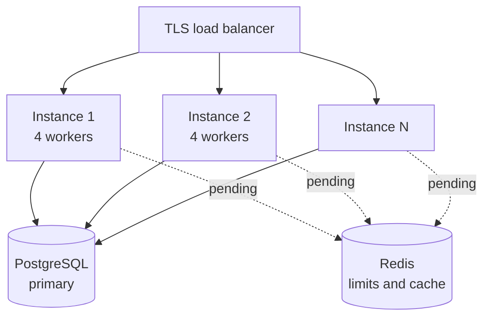

# Deployment

## Before exposing the service

- [ ] `JWT_SECRET` generated with `secrets.token_urlsafe(48)`, never the example one
- [ ] `API_KEY_PEPPER` with its **own distinct** value, different from `JWT_SECRET`
- [ ] `PORTAL_PASSWORD` changed from the portal (`is_bootstrap: false`)
- [ ] `DOCS_USER` and `DOCS_PASSWORD` different from the portal ones
- [ ] `CORS_ORIGINS` with the exact list, never `*`
- [ ] `DB_POOL_SIZE` sized for the worker count
- [ ] Models downloaded: `python scripts/fetch_models.py`
- [ ] `GET /api/voice/system` returns `scoring_active: "embedding"`
- [ ] Thresholds re-measured against the real population ([Limitations](limitaciones.md))
- [ ] TLS in front of the service
- [ ] PostgreSQL backups configured

!!! danger "The threshold item is not optional"
    The default values are verified, not calibrated. Before this service protects anything
    real, read [Known limitations](limitaciones.md) in full.

---

## Serving the application

### Uvicorn with several workers

```bash
uvicorn backend.main:app \
  --host 0.0.0.0 \
  --port 8000 \
  --workers 4 \
  --proxy-headers \
  --forwarded-allow-ips='*'
```

!!! warning "Workers do not share in-memory state"
    The rate limiter, the replay guard and the API key cache live in each process's memory.
    With 4 workers, the effective attempt limit is 4 times the configured one. Digit
    challenges **are** shared, because they live in PostgreSQL. See
    [Limitations](limitaciones.md#in-memory-state).

### systemd

```ini
[Unit]
Description=Biometric Login Service
After=network.target postgresql.service

[Service]
Type=exec
User=biometric
WorkingDirectory=/opt/login-biometrico-service
Environment="PATH=/opt/login-biometrico-service/.venv/bin"
ExecStart=/opt/login-biometrico-service/.venv/bin/uvicorn backend.main:app \
    --host 127.0.0.1 --port 8000 --workers 4 --proxy-headers
Restart=always
RestartSec=5

NoNewPrivileges=true
PrivateTmp=true
ProtectSystem=strict
ProtectHome=true
ReadWritePaths=/opt/login-biometrico-service/backend/biometrics

[Install]
WantedBy=multi-user.target
```

### Docker

```dockerfile
FROM python:3.12-slim

RUN apt-get update && apt-get install -y --no-install-recommends \
        libgl1 libglib2.0-0 \
    && rm -rf /var/lib/apt/lists/*

WORKDIR /app

COPY requirements.txt .
RUN pip install --no-cache-dir -r requirements.txt

COPY backend/ backend/
COPY static/ static/
COPY scripts/fetch_models.py scripts/

RUN python scripts/fetch_models.py

RUN useradd --create-home biometric && chown -R biometric:biometric /app
USER biometric

EXPOSE 8000
HEALTHCHECK --interval=30s --timeout=5s --start-period=20s \
    CMD python -c "import urllib.request,sys; sys.exit(0 if urllib.request.urlopen('http://localhost:8000/health').status==200 else 1)"

CMD ["uvicorn", "backend.main:app", "--host", "0.0.0.0", "--port", "8000", "--workers", "4"]
```

`libgl1` and `libglib2.0-0` are needed by OpenCV. Models are downloaded at build time so the
image is self-contained and startup does not depend on the network.

---

## Nginx in front

```nginx
server {
    listen 443 ssl http2;
    server_name biometric.mydomain.com;

    ssl_certificate     /etc/letsencrypt/live/biometric.mydomain.com/fullchain.pem;
    ssl_certificate_key /etc/letsencrypt/live/biometric.mydomain.com/privkey.pem;

    client_max_body_size 25M;

    location / {
        proxy_pass http://127.0.0.1:8000;
        proxy_set_header Host              $host;
        proxy_set_header X-Real-IP         $remote_addr;
        proxy_set_header X-Forwarded-For   $proxy_add_x_forwarded_for;
        proxy_set_header X-Forwarded-Proto $scheme;

        proxy_read_timeout 60s;
        proxy_send_timeout 60s;
    }
}
```

!!! warning "`client_max_body_size` and the rate limiter"
    A burst of 28 JPEGs at 640x480 is around 3-6 MB, but leave headroom. And without
    `--proxy-headers` on uvicorn, every request appears to come from `127.0.0.1`: the
    per-IP limiter stops distinguishing users and becomes a global limit.

---

## PostgreSQL

```sql
CREATE DATABASE "auth-biometric" ENCODING 'UTF8';
CREATE USER biometric WITH ENCRYPTED PASSWORD 'a-long-password';
GRANT ALL PRIVILEGES ON DATABASE "auth-biometric" TO biometric;
```

Computing `max_connections`:

```
max_connections >= (DB_POOL_SIZE + DB_MAX_OVERFLOW) x n_workers + headroom
```

With the defaults and 4 workers: `(20 + 40) x 4 = 240`, plus headroom for backups and
administration. PostgreSQL's default `max_connections` is 100.

!!! danger "Biometric data is stored unencrypted"
    Templates are plain `BYTEA`. Anyone who can read the database has the vectors. At
    minimum, enable volume-level encryption at rest and restrict database access.
    Column-level encryption is pending ([Limitations](limitaciones.md)).

### Backups

```bash
pg_dump -Fc -U biometric auth-biometric > biometric-$(date +%F).dump
```

!!! warning "The backup contains biometric data"
    A dump of this database is a file of sensitive data under Law 1581. Encrypt the backup,
    store it with restricted access, and give it a retention period.

---

## Monitoring

### Probes

| Probe | Endpoint | Criterion |
| --- | --- | --- |
| Liveness | `GET /health` | Responds at all |
| Readiness | `GET /health` | `status: "ok"` (200) |

```json
{"status": "ok", "database": true, "face_models": true, "version": "0.4.0"}
```

Returns **503** when the database is unreachable or the face models are missing.

### What to watch

| Signal | Alert threshold | What it usually means |
| --- | --- | --- |
| 429 rate | Sudden spike | Brute force, or a badly sized limit |
| 401 rate with an API key | Any increase | Expired or badly deployed key |
| `verified: false` by identity | Sustained rise | Bad calibration or a camera change |
| 400 by capture | Sustained rise | Lighting or camera problem at one site |
| `/api/face/login` latency | > 3 s | Database pool exhausted or CPU saturated |
| `scoring_active` != `embedding` | Always | Someone enrolled a voice without the model loaded |

!!! tip "Tell the rejections apart"
    A spike in 400s is an **environment** problem (light, camera, microphone). A spike in
    `verified: false` is a **calibration** problem. Confusing them leads to lowering the
    threshold when what was needed was more light.

### Logging

```python
logger.info(
    "login",
    extra={
        "uuid": r["uuid"],
        "verified": r["verified"],
        "similarity": r["similarity"],
        "scoring": r.get("scoring"),
        "method": "face",
    },
)
```

!!! danger "Never log biometrics"
    Do not store images, audio or vectors in logs. Log the UUID, the outcome and the score.
    A log file with faces in it is a sensitive-data breach waiting to happen.

---

## Scaling



The service is **almost** stateless: everything persistent lives in PostgreSQL. The only
thing preventing safe horizontal scaling is the in-memory state (limiter, replay guard, key
cache).

!!! warning "With several instances, anti-replay weakens"
    Each instance only remembers the captures it handled itself. A resent burst can land on
    a different instance and pass. Until that state moves to Redis, horizontal scaling
    reduces protection.

**Approximate cost per request** (CPU, one modern core):

| Operation | Time |
| --- | --- |
| Face detection + embedding (1 image) | 40-80 ms |
| Face login (28 frames) | 1.2-2.5 s |
| Speaker embedding (6 s of audio) | 150-300 ms |
| Challenge verification (4 digits) | 300-600 ms |

Face login is by far the most expensive. Size your capacity around that figure.
