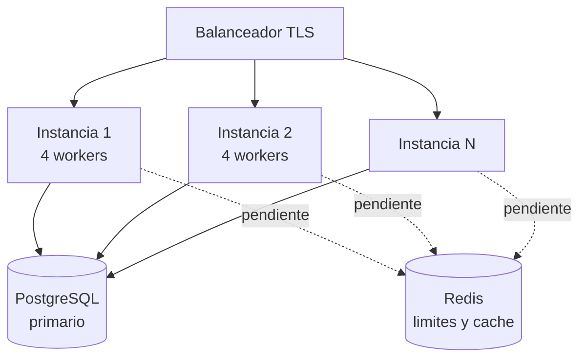

# Despliegue

## Antes de exponer el servicio

- [ ] `JWT_SECRET` generado con `secrets.token_urlsafe(48)`, nunca el del ejemplo
- [ ] `API_KEY_PEPPER` con valor **propio y distinto** de `JWT_SECRET`
- [ ] `PORTAL_PASSWORD` cambiado desde el portal (`is_bootstrap: false`)
- [ ] `DOCS_USER` y `DOCS_PASSWORD` distintos de los del portal
- [ ] `CORS_ORIGINS` con la lista exacta, nunca `*`
- [ ] `DB_POOL_SIZE` dimensionado para el numero de workers
- [ ] Modelos descargados: `python scripts/fetch_models.py`
- [ ] `GET /api/voice/system` devuelve `scoring_active: "embedding"`
- [ ] Umbrales remedidos con la poblacion real ([Limitaciones](limitaciones.md))
- [ ] TLS delante del servicio
- [ ] Copias de seguridad de PostgreSQL configuradas

!!! danger "El punto de los umbrales no es opcional"
    Los valores por defecto estan comprobados, no calibrados. Antes de que este servicio
    proteja algo real, lee [Limitaciones conocidas](limitaciones.md) entera.

---

## Servir la aplicacion

### Uvicorn con varios workers

```bash
uvicorn backend.main:app \
  --host 0.0.0.0 \
  --port 8000 \
  --workers 4 \
  --proxy-headers \
  --forwarded-allow-ips='*'
```

!!! warning "Los workers no comparten estado en memoria"
    El limitador de intentos, la guarda de repeticion y la cache de API keys viven en la
    memoria de cada proceso. Con 4 workers, el limite efectivo de intentos es 4 veces el
    configurado. Los desafios de digitos **si** se comparten, porque estan en PostgreSQL.
    Ver [Limitaciones](limitaciones.md#estado-en-memoria).

### systemd

```ini
[Unit]
Description=Login Biometrico Service
After=network.target postgresql.service

[Service]
Type=exec
User=biometrico
WorkingDirectory=/opt/login-biometrico-service
Environment="PATH=/opt/login-biometrico-service/.venv/bin"
ExecStart=/opt/login-biometrico-service/.venv/bin/uvicorn backend.main:app \
    --host 127.0.0.1 --port 8000 --workers 4 --proxy-headers
Restart=always
RestartSec=5

NoNewPrivileges=true
PrivateTmp=true
ProtectSystem=strict
ProtectHome=true
ReadWritePaths=/opt/login-biometrico-service/backend/biometrics

[Install]
WantedBy=multi-user.target
```

### Docker

El [`Dockerfile`](https://github.com/AIWaveSystems/biometric-service-py/blob/main/Dockerfile)
esta en la raiz del repositorio. La imagen es autosuficiente: los modelos ONNX se descargan
durante la construccion, asi que el arranque no depende de la red.

```bash
docker build -t login-biometrico-service .

docker run -d --name biometrico \
  -e DATABASE_URL='postgresql+psycopg2://usuario:clave@bd:5432/auth-biometric' \
  -e JWT_SECRET='...' \
  -e API_KEY_PEPPER='...' \
  -e PORTAL_USER=admin \
  -e PORTAL_PASSWORD='...' \
  -p 8000:8000 \
  login-biometrico-service
```

| Detalle | Por que |
| --- | --- |
| `libgl1` y `libglib2.0-0` | Los necesita OpenCV |
| Modelos descargados en la build | La imagen no depende de la red al arrancar |
| Comprobacion de modelos en la build | Falla la construccion si algun ONNX no quedo dentro |
| Corre como `biometrico` (uid 10001) | Nunca como root |
| `HEALTHCHECK` sobre `/health` | Marca la imagen no sana si la base no responde |

### Variables de arranque de la imagen

| Variable | Por defecto | Para que |
| --- | --- | --- |
| `UVICORN_HOST` | `0.0.0.0` | Interfaz de escucha |
| `UVICORN_PORT` | `8000` | Puerto |
| `UVICORN_WORKERS` | `1` | Procesos de uvicorn |

!!! warning "Por que `UVICORN_WORKERS` viene en 1"
    El limitador de intentos, la guarda de repeticion y la cache de API keys viven en la
    memoria de cada proceso. Con 4 workers el limite efectivo de intentos se multiplica por
    4 y el anti-replay se debilita. Escalar con **mas contenedores de un worker** detras de
    un balanceador es preferible a subir este valor, hasta que ese estado se mueva a Redis.
    Ver [Limitaciones](limitaciones.md#estado-en-memoria).

!!! danger "La imagen SI redistribuye los modelos"
    El repositorio no los incluye, pero la imagen construida si. Al distribuirla te aplican
    las licencias de SFace y WeSpeaker (Apache 2.0), YuNet (MIT) y OpenSeeFace (BSD
    2-Clause). Conserva los avisos. Ver [Licencia](../licencia.md).

---

## Nginx delante

```nginx
server {
    listen 443 ssl http2;
    server_name biometrico.midominio.com;

    ssl_certificate     /etc/letsencrypt/live/biometrico.midominio.com/fullchain.pem;
    ssl_certificate_key /etc/letsencrypt/live/biometrico.midominio.com/privkey.pem;

    client_max_body_size 25M;

    location / {
        proxy_pass http://127.0.0.1:8000;
        proxy_set_header Host              $host;
        proxy_set_header X-Real-IP         $remote_addr;
        proxy_set_header X-Forwarded-For   $proxy_add_x_forwarded_for;
        proxy_set_header X-Forwarded-Proto $scheme;

        proxy_read_timeout 60s;
        proxy_send_timeout 60s;
    }
}
```

!!! warning "`client_max_body_size` y el limitador"
    Una rafaga de 28 JPEG a 640x480 ronda los 3-6 MB, pero conviene margen. Y sin
    `--proxy-headers` en uvicorn, todas las peticiones parecen venir de `127.0.0.1`: el
    limitador por IP deja de distinguir usuarios y se convierte en un limite global.

---

## PostgreSQL

```sql
CREATE DATABASE "auth-biometric" ENCODING 'UTF8';
CREATE USER biometrico WITH ENCRYPTED PASSWORD 'una-clave-larga';
GRANT ALL PRIVILEGES ON DATABASE "auth-biometric" TO biometrico;
```

Calculo de `max_connections`:

```
max_connections >= (DB_POOL_SIZE + DB_MAX_OVERFLOW) x n_workers + margen
```

Con los valores por defecto y 4 workers: `(20 + 40) x 4 = 240`, mas margen para copias de
seguridad y administracion. El `max_connections` por defecto de PostgreSQL es 100.

!!! danger "Los datos biometricos se guardan sin cifrar"
    Las plantillas son `BYTEA` en claro. Quien lea la base tiene los vectores. Como minimo,
    activa cifrado en reposo del volumen y restringe el acceso a la base. El cifrado a
    nivel de columna esta pendiente ([Limitaciones](limitaciones.md)).

### Copias de seguridad

```bash
pg_dump -Fc -U biometrico auth-biometric > biometrico-$(date +%F).dump
```

!!! warning "La copia contiene datos biometricos"
    Un volcado de esta base es un fichero de datos sensibles bajo la Ley 1581. Ciframe la
    copia, guardala con acceso restringido y aplicale un plazo de retencion.

---

## Vigilancia

### Sondas

| Sonda | Endpoint | Criterio |
| --- | --- | --- |
| Vivo | `GET /health` | Responde algo |
| Listo | `GET /health` | `status: "ok"` (200) |

```json
{"status": "ok", "database": true, "face_models": true, "version": "0.4.0"}
```

Devuelve **503** si la base no responde o faltan los modelos faciales.

### Que vigilar

| Senal | Umbral de alerta | Que suele significar |
| --- | --- | --- |
| Tasa de 429 | Sube de golpe | Ataque de fuerza bruta, o limite mal dimensionado |
| Tasa de 401 con API key | Cualquier subida | Clave caducada o mal desplegada |
| `verified: false` por identidad | Sube de forma sostenida | Umbral mal calibrado o cambio de camaras |
| 400 por captura | Sube de forma sostenida | Problema de iluminacion o de camara en un sitio |
| Latencia de `/api/face/login` | > 3 s | Pool de base agotado o CPU saturada |
| `scoring_active` != `embedding` | Siempre | Alguien matriculo voz sin el modelo cargado |

!!! tip "Distingue los rechazos"
    Un pico de 400 es un problema de **entorno** (luz, camara, microfono). Un pico de
    `verified: false` es un problema de **calibracion**. Confundirlos lleva a bajar el
    umbral cuando lo que hacia falta era mas luz.

### Registros

```python
logger.info(
    "login",
    extra={
        "uuid": r["uuid"],
        "verified": r["verified"],
        "similarity": r["similarity"],
        "scoring": r.get("scoring"),
        "method": "face",
    },
)
```

!!! danger "Nunca registres la biometria"
    No guardes imagenes, audio ni vectores en los registros. Registra el UUID, el
    resultado y la puntuacion. Un fichero de registro con caras dentro es una brecha de
    datos sensibles esperando a ocurrir.

---

## Escalado



El servicio es **casi** sin estado: todo lo persistente esta en PostgreSQL. Lo unico que
impide escalar horizontalmente con garantias es el estado en memoria (limitador, guarda de
repeticion, cache de claves).

!!! warning "Con varias instancias, el anti-replay se debilita"
    Cada instancia recuerda solo las capturas que atendio ella. Una rafaga reenviada puede
    caer en otra instancia y pasar. Hasta que ese estado se mueva a Redis, el escalado
    horizontal reduce la proteccion.

**Coste aproximado por peticion** (CPU, un nucleo moderno):

| Operacion | Tiempo |
| --- | --- |
| Deteccion + embedding facial (1 imagen) | 40-80 ms |
| Login facial (28 frames) | 1.2-2.5 s |
| Embedding de locutor (6 s de audio) | 150-300 ms |
| Verificacion de desafio (4 digitos) | 300-600 ms |

El login facial es, con diferencia, lo mas caro. Dimensiona por esa cifra.
