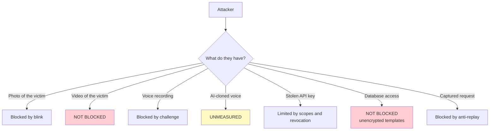

# Security and thresholds

## What each mechanism protects

| Attack | Defence | Measured effectiveness |
| --- | --- | --- |
| Printed photo or screen at face login | EAR blink over the burst | Good against a still photo |
| Resubmitting a captured request | Hash-based replay guard | Total against identical bytes |
| Voice recording played through a speaker | Random digit challenge | High: 5040 combinations |
| Password brute force | Per-IP and per-user limiter | 10 attempts per minute |
| Same voice on two accounts | Duplicate check at enrolment | Caught one case at 0.916 |
| Leaked API key | Scopes, expiry, revocation, rotation | Good with one key per system |
| User enumeration | Filler hash and uniform messages | Good on login endpoints |

---

## What it does **not** protect

!!! danger "Uncovered attacks"
    | Attack | Status |
    | --- | --- |
    | Video of the person blinking on a screen | **No defence.** EAR cannot tell a real blink from one on video |
    | 3D mask or physical spoofing | **No defence.** No texture or depth analysis |
    | AI-cloned voice from samples | **Unmeasured.** The challenge helps, but a real-time clone would pass |
    | Real-time face deepfake | **No defence** |
    | Anyone who can read the database | Templates are stored **unencrypted** |

The blink is a **weak** liveness proof. It stops printed photos, which is the usual
opportunistic attack. It does not stop someone with a video of the victim.

---

## About the thresholds

### The real state of calibration

!!! danger "The thresholds are verified, not calibrated"
    Verified means it was measured that they work with the available data. Calibrated means
    they were chosen from an error curve over a representative population. This service is
    in the first category.

    The face test population is **5 real, distinct people** (public faces, as impostors) and
    the voice population is **one real person** and several synthetic TTS voices. Separating
    TTS from human speech is easy, so **every face-acceptance-rate (FAR) figure of voice
    measured against that population is inflated in our favour**.

### Face threshold

`FACE_THRESHOLD = 0.363` is OpenCV's recommended value for SFace, not a value measured on
this installation.

| Measurement | Result |
| --- | --- |
| Genuine, good light | 0.72 - 1.00 |
| Impostor, good light | 0.13 - 0.27 |
| Impostor, low light with noise | up to **0.326** |
| Remaining margin in low light | **0.037** |

### Measurement with real impostors (face)

The face threshold was measured against **5 real, distinct people** (public faces) using the
images in `scripts/imagenes_test/famosos/` with the scripts that reproduce what
`/api/face/verify` does:

```bash
python scripts/calibrate_face.py scripts/imagenes_test/famosos 0.363
python scripts/diagnose_face.py scripts/imagenes_test/famosos
```

| Measurement (real mode, 5 people, 16 photos) | Result |
| --- | --- |
| Genuine (same person), worst case | 0.676 |
| Impostor (different person), best case | 0.253 |
| **Separation** | **+0.423** |
| False rejects at 0.363 | 0/8 |
| False accepts at 0.363 | **0/88** |

Counting all pairs (not just real mode), the best impostor was **0.314** and separation
+0.326, with 0 false accepts and 0 false rejects at 0.363.

!!! note "What this means and what it does not"
    With these 5 people the **0.363 threshold does not cross anyone distinct**: there is
    separation and comfortable margin. It is still a verification, not a final calibration:
    choosing a value from an error curve needs 30+ people with several takes each. The
    threshold was not raised: the margin is already wide and raising it adds false rejects
    with no measurable gain on this data.

!!! warning "The margin narrows with the light"
    The tested impostors (`messi`, `lena`, `impostor_a`) look very different from the
    account holder. An impostor of the same sex, age and skin tone starts higher, and in low
    light would cross. See [Limitations](limitaciones.md#low-light-in-face-login).

### Voice threshold

`VOICE_EMBEDDING_THRESHOLD = 0.35` with ResNet34.

| Measurement | Result |
| --- | --- |
| Same speaker, worst case | 0.411 |
| Foreign human voice, best case | 0.270 |
| **Margin** | **+0.141** |

!!! danger "A margin of 0.141 is narrow"
    And it was measured with **a single human impostor**. A healthy production margin is
    above 0.25 and is measured with dozens of people. Add recordings to `datos_otros/` and
    re-measure before trusting this number.

### Re-measuring with your population

```bash
python scripts/diagnose_voice_db.py /path/to/wavs
python scripts/test_speaker_embedding.py
python scripts/calibrate_face.py
python scripts/calibrate_voice.py
```

`diagnose_voice_db.py` builds the cross-matrix of every stored template, scores fresh audio
against every account, and flags accounts that share a voice.

!!! tip "How many people are needed"
    For a meaningful threshold: **30 or more real people**, with several takes each, under
    conditions resembling production. With fewer, what you get is a check that the system
    works, not a calibration.

---

## Data protection

### What is stored

| Data | Format | Reversible? |
| --- | --- | --- |
| Face template | 128 float32 (`BYTEA`) | Not to the original image, but it **identifies** |
| Voice embedding | 256 float32 (`BYTEA`) | Same |
| Voice GMM parameters | Serialised (`BYTEA`) | No |
| Digit models | GMM per digit (`BYTEA`) | No |
| Passwords | bcrypt | No |
| API key secrets | HMAC-SHA256 with pepper | No |
| Original images and audio | **Not stored** | — |

!!! danger "A template is still biometric data"
    Being unable to reconstruct the face does not make it anonymous: it identifies a person
    uniquely and permanently. A leaked password can be changed; a face cannot. Legally it is
    sensitive data with all the attendant obligations.

### Law 1581 of 2012 (Colombia)

Biometric data is **sensitive data** (art. 5). That requires:

| Obligation | Status in this service |
| --- | --- |
| Prior, express and informed consent | **Pending.** No consent record exists |
| Declared and limited purpose | Responsibility of the integrator |
| Right to erasure | Covered by `DELETE /api/users/{username}` |
| Security measures | Partial: templates are **not** encrypted |
| National Database Registry | Responsibility of the data controller |
| Incident notification to the SIC | Your own procedure |

!!! danger "The consent record is missing"
    There is no table recording who consented, when and to what. That is a legal
    requirement, not an optional improvement, and must be resolved before processing real
    people's data.

### Minimisation

What the service already does well: it **stores no images or audio**. Only the mathematical
template. Preserve that property — do not add a "keep the photo for auditing" feature
without evaluating what it implies.

---

## Hardening

### Mandatory

- [ ] TLS on all traffic, including the internal network
- [ ] `API_KEY_PEPPER` different from `JWT_SECRET`
- [ ] Portal password changed (`is_bootstrap: false`)
- [ ] Explicit `CORS_ORIGINS`, never `*`
- [ ] Service on an internal network, not directly published
- [ ] Database unreachable from outside the service network
- [ ] Encrypted backups

### Recommended

- [ ] Encryption at rest for the PostgreSQL volume
- [ ] One API key per system and environment, with minimum scopes
- [ ] Key rotation every 90 days
- [ ] Audit log of `admin` operations
- [ ] Alerts on rises in 401, 403 or 429
- [ ] Defined retention and automatic deletion of dormant accounts

### Secret rotation

| Secret | Effect of rotating it |
| --- | --- |
| `JWT_SECRET` | Closes every session and portal token. If `API_KEY_PEPPER` is empty, **also invalidates every API key** |
| `API_KEY_PEPPER` | Invalidates every API key |
| A specific API key | `POST /api/clients/{uuid}/rotate`, no grace period |
| Portal password | Affects only that operator |

!!! warning "Rotate the pepper first"
    With `API_KEY_PEPPER` empty and inheriting `JWT_SECRET`, a routine JWT secret rotation
    takes down every integration at once. Separate them before the first rotation.

---

## Threat model summary



The two red gaps — video on a screen and database access — are where improvement effort
would pay off most.
