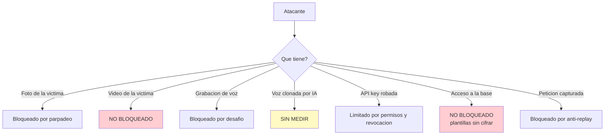

# Seguridad y umbrales

## Que protege cada mecanismo

| Ataque | Defensa | Eficacia medida |
| --- | --- | --- |
| Foto impresa o pantalla en el login facial | Parpadeo por EAR sobre la rafaga | Buena contra foto fija |
| Reenvio de una peticion capturada | Guarda de repeticion por hash | Total contra bytes identicos |
| Grabacion de voz reproducida por altavoz | Desafio de digitos aleatorios | Alta: 5040 combinaciones |
| Fuerza bruta de contrasena | Limitador por IP y usuario | 10 intentos por minuto |
| Misma voz en dos cuentas | Control de duplicados en la matricula | Detecto un caso a 0.916 |
| Fuga de una API key | Permisos, caducidad, revocacion, rotacion | Buena si hay una clave por sistema |
| Enumeracion de usuarios | Hash de relleno y mensajes uniformes | Buena en los endpoints de login |

---

## Que **no** protege

!!! danger "Ataques sin cobertura"
    | Ataque | Estado |
    | --- | --- |
    | Video de la persona parpadeando en una pantalla | **Sin defensa.** El EAR no distingue un parpadeo real de uno en video |
    | Mascara 3D o suplantacion fisica | **Sin defensa.** No hay analisis de textura ni profundidad |
    | Voz clonada por IA a partir de muestras | **Sin medir.** El desafio ayuda, pero un clon en tiempo real lo pasaria |
    | Deepfake facial en tiempo real | **Sin defensa** |
    | Quien lea la base de datos | Las plantillas estan **sin cifrar** |

El parpadeo es una prueba de vida **debil**. Frena la foto impresa, que es el ataque
oportunista habitual. No frena a alguien con un video de la victima.

---

## Sobre los umbrales

### Estado real de la calibracion

!!! danger "Los umbrales estan comprobados, no calibrados"
    Comprobado significa que se midio que funcionan con los datos disponibles. Calibrado
    significa que se eligieron a partir de una curva de error sobre una poblacion
    representativa. Este servicio esta en lo primero.

    La poblacion de prueba fue **una persona real** y varias voces sinteticas de TTS.
    Separar TTS de habla humana es facil, asi que **toda cifra de tasa de falsa aceptacion
    (FAR) medida contra esa poblacion esta inflada a favor**.

### Umbral facial

`FACE_THRESHOLD = 0.363` es el valor recomendado por OpenCV para SFace, no un valor medido
en esta instalacion.

| Medicion | Resultado |
| --- | --- |
| Genuino, buena luz | 0.72 - 1.00 |
| Impostor, buena luz | 0.13 - 0.27 |
| Impostor, poca luz con ruido | hasta **0.326** |
| Margen restante con poca luz | **0.037** |

!!! warning "El margen se estrecha con la luz"
    Los impostores probados (`messi`, `lena`, `impostor_a`) son visualmente muy distintos
    del titular. Un impostor del mismo sexo, edad y tono de piel arranca mas alto, y con
    poca luz cruzaria. Ver [Limitaciones](limitaciones.md#poca-luz-en-el-login-facial).

### Umbral de voz

`VOICE_EMBEDDING_THRESHOLD = 0.35` con ResNet34.

| Medicion | Resultado |
| --- | --- |
| Mismo hablante, peor caso | 0.411 |
| Voz ajena humana, mejor caso | 0.270 |
| **Margen** | **+0.141** |

!!! danger "Un margen de 0.141 es estrecho"
    Y esta medido con **un solo impostor humano**. Un margen sano para produccion esta por
    encima de 0.25 y se mide con decenas de personas. Anade grabaciones a `datos_otros/` y
    remide antes de confiar en este numero.

### Como remedir con tu poblacion

```bash
python scripts/diagnose_voice_db.py /ruta/con/wavs
python scripts/test_speaker_embedding.py
python scripts/calibrate_face.py
python scripts/calibrate_voice.py
```

`diagnose_voice_db.py` construye la matriz cruzada de todas las plantillas, puntua audio
fresco contra todas las cuentas y senala las que comparten voz.

!!! tip "Cuanta gente hace falta"
    Para un umbral con sentido: **30 personas reales o mas**, con varias tomas cada una, en
    condiciones parecidas a las de produccion. Con menos, lo que obtienes es una
    comprobacion de que el sistema funciona, no una calibracion.

---

## Proteccion de datos

### Que se guarda

| Dato | Formato | Reversible? |
| --- | --- | --- |
| Plantilla facial | 128 float32 (`BYTEA`) | No a la imagen original, pero **identifica** |
| Embedding de voz | 256 float32 (`BYTEA`) | Igual |
| Parametros GMM de voz | Serializados (`BYTEA`) | No |
| Modelos de digitos | GMM por digito (`BYTEA`) | No |
| Contrasenas | bcrypt | No |
| Secretos de API key | HMAC-SHA256 con pimienta | No |
| Imagenes y audio originales | **No se guardan** | — |

!!! danger "Una plantilla sigue siendo un dato biometrico"
    Que no se pueda reconstruir la cara no la convierte en anonima: identifica a una
    persona de forma univoca y permanente. Una contrasena filtrada se cambia; una cara, no.
    Legalmente es un dato sensible con todas sus obligaciones.

### Ley 1581 de 2012 (Colombia)

Los datos biometricos son **datos sensibles** (art. 5). Eso obliga a:

| Obligacion | Estado en este servicio |
| --- | --- |
| Consentimiento previo, expreso e informado | **Pendiente.** No hay registro de consentimiento |
| Finalidad declarada y limitada | Responsabilidad de quien integra |
| Derecho de supresion | `DELETE /api/users/{username}` lo cubre |
| Medidas de seguridad | Parcial: las plantillas **no** estan cifradas |
| Registro Nacional de Bases de Datos | Responsabilidad del responsable del tratamiento |
| Aviso de incidentes a la SIC | Procedimiento propio |

!!! danger "Falta el registro de consentimiento"
    No existe una tabla que guarde quien consintio, cuando y a que. Es un requisito legal,
    no una mejora opcional, y hay que resolverlo antes de tratar datos de personas reales.

### Minimizacion

Lo que el servicio ya hace bien: **no guarda imagenes ni audio**. Solo la plantilla
matematica. Manten esa propiedad — no anadas un "guardar la foto para auditoria" sin
evaluar antes lo que implica.

---

## Endurecimiento

### Obligatorio

- [ ] TLS en todo el trafico, tambien en la red interna
- [ ] `API_KEY_PEPPER` distinto de `JWT_SECRET`
- [ ] Contrasena de portal cambiada (`is_bootstrap: false`)
- [ ] `CORS_ORIGINS` explicito, nunca `*`
- [ ] Servicio en red interna, no publicado directamente
- [ ] Base de datos sin acceso desde fuera de la red del servicio
- [ ] Copias de seguridad cifradas

### Recomendado

- [ ] Cifrado en reposo del volumen de PostgreSQL
- [ ] Una API key por sistema y entorno, con permisos minimos
- [ ] Rotacion de claves cada 90 dias
- [ ] Registro de auditoria de operaciones `admin`
- [ ] Alerta ante subidas de 401, 403 o 429
- [ ] Retencion definida y borrado automatico de cuentas inactivas

### Rotacion de secretos

| Secreto | Efecto de rotarlo |
| --- | --- |
| `JWT_SECRET` | Cierra todas las sesiones y tokens de portal. Si `API_KEY_PEPPER` esta vacia, **tambien invalida todas las API keys** |
| `API_KEY_PEPPER` | Invalida todas las API keys |
| API key concreta | `POST /api/clients/{uuid}/rotate`, sin periodo de gracia |
| Contrasena de portal | Solo afecta a ese operador |

!!! warning "Rota primero la pimienta"
    Con `API_KEY_PEPPER` vacia heredando `JWT_SECRET`, una rotacion rutinaria del secreto
    JWT tumba de golpe todas las integraciones. Separalos antes de la primera rotacion.

---

## Modelo de amenazas resumido



Los dos huecos rojos —video en pantalla y acceso a la base— son los que mas rentabilidad
darian a un esfuerzo de mejora.
